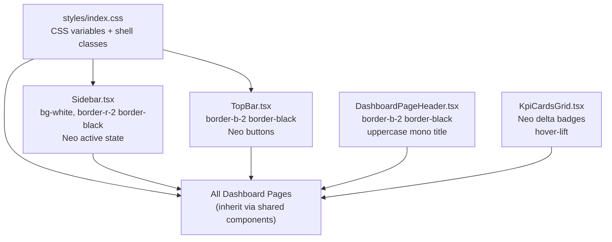

# Design Document: Dashboard Redesign (Neo-Brutalist)

## Overview

The dashboard currently uses a dark slate-900 sidebar, soft rounded cards, a light gray canvas (`#f5f6f8`), and Inter font — a completely different visual vocabulary from the landing and docs pages. This redesign migrates the entire authenticated dashboard shell to the **Neo_Style** design language already established on the landing and docs pages: bold 2px black borders, hard drop shadows (`4px 4px 0 0 rgba(0,0,0,1)`), white/near-white backgrounds, uppercase JetBrains Mono typography, and brand accent colors (`#5dadec`, `#34d399`, `#ef4444`).

The primary strategy is **centralized change**: update the shared shell components (`Sidebar.tsx`, `TopBar.tsx`, `DashboardPageHeader.tsx`, `KpiCardsGrid.tsx`) and the global CSS (`styles/index.css`) so that all dashboard pages inherit the new look automatically, with zero or minimal per-page changes.

### Key Research Findings

- **DocsSidebar** (`app/shared/docs/DocsSidebar.tsx`) is the reference implementation for Neo_Style navigation. Active links use `shadow-[2px_2px_0px_0px_rgba(0,0,0,1)] translate-x-1 border-black bg-white`, category headers use `border-b-2 border-black uppercase tracking-wide font-bold`, and the sidebar itself uses `border-r-2 border-black bg-[#f4f4f5]`.
- **Sidebar.tsx** (`app/shell/components/layout/Sidebar.tsx`) currently uses `bg-[#0f172a]` (slate-900), `border-slate-700`, and sky-blue active indicators. It supports desktop collapse/expand, drag-to-resize, and mobile drawer modes — all of which must be preserved.
- **TopBar.tsx** (`app/shell/components/layout/TopBar.tsx`) currently uses `border-slate-200 bg-white` with soft rounded buttons. The project name is `text-slate-800 font-bold tracking-tight` (not uppercase mono).
- **DashboardPageHeader.tsx** uses `border-b border-slate-100`, a soft `rounded-xl border-slate-100 shadow-sm` icon container, and `text-slate-900 font-bold tracking-tight` title.
- **KpiCardsGrid.tsx** delegates card rendering to `NeoCard` (already partially Neo_Style), but the delta badge uses soft `bg-emerald-100`/`bg-rose-100` tones instead of the brand green/red with black borders.
- **styles/index.css** has `.dashboard-sidebar` forcing `bg-[#0f172a]`, `.dashboard-card-surface` with `border-radius: 0.75rem` and soft border, and `.dashboard-modern` overrides mapping `bg-blue-600` to `#68b5e6`. All of these need updating.
- **CSS variable** `--dashboard-card-border` is already defined and used by `.dashboard-card-surface` — changing it to `#000000` propagates to all card surfaces.

---

## Architecture

The redesign is a **pure visual layer change** — no routing, data fetching, or business logic is modified. All changes are confined to:

1. **Global CSS** (`styles/index.css`) — update CSS variables and shell class overrides
2. **Shell layout components** — `Sidebar.tsx`, `TopBar.tsx`
3. **Shared UI components** — `DashboardPageHeader.tsx`, `KpiCardsGrid.tsx` (card rendering section)



The cascade ensures that individual dashboard pages (General, Sessions, Analytics, Stability, Alerts, Settings, etc.) receive the Neo_Style automatically through the shared components they already import.

---

## Components and Interfaces

### 1. `styles/index.css` — CSS Variable and Shell Class Updates

**Changes:**

```css
/* Before */
--dashboard-canvas: #f5f6f8;
--dashboard-card-border: #e2e8f0;

/* After */
--dashboard-canvas: #f4f4f5;
--dashboard-card-border: #000000;
```

```css
/* .dashboard-sidebar: replace dark bg with light Neo_Style */
.dashboard-sidebar {
  border-right: 2px solid #000000;
  background: #ffffff !important;
  color: #0f172a !important;
}

/* .dashboard-card-surface: replace rounded soft card with Neo hard card */
.dashboard-card-surface {
  background: #ffffff;
  border: 2px solid #000000;
  border-radius: 0;
  box-shadow: 4px 4px 0 0 rgba(0, 0, 0, 1);
}

/* .dashboard-topbar: upgrade to 2px black border */
.dashboard-topbar {
  border-bottom: 2px solid #000000 !important;
  background: #ffffff !important;
}

/* .dashboard-modern accent overrides: map to #5dadec */
.dashboard-modern .bg-blue-600 { background-color: #5dadec !important; }
.dashboard-modern .border-blue-600 { border-color: #5dadec !important; }
.dashboard-modern .text-blue-600 { color: #5dadec !important; }
```

### 2. `Sidebar.tsx` — Neo-Brutalist Sidebar

**Interface:** No prop changes. All changes are internal styling.

**Key visual changes:**

| Element | Before | After |
|---|---|---|
| Sidebar background | `bg-[#0f172a]` (slate-900) | `bg-white` |
| Right border | `border-r border-slate-700` (via CSS) | `border-r-2 border-black` (via CSS) |
| Section labels | `text-slate-400 text-[11px]` | `text-black font-bold uppercase tracking-wide border-b-2 border-black` |
| Active nav item | `bg-slate-700/80 border-slate-600` + sky bar | `bg-white border-black shadow-[2px_2px_0px_0px_rgba(0,0,0,1)] translate-x-[-1px]` |
| Active icon | `text-sky-300` | `text-[#5dadec]` |
| Inactive nav item | `text-slate-300 hover:bg-slate-700/50` | `text-gray-600 hover:bg-gray-200 hover:border-gray-400` |
| Team/Project switcher | `bg-slate-800/80 border-slate-700` | `bg-white border-2 border-black hover:shadow-[2px_2px_0px_0px_rgba(0,0,0,1)]` |
| Collapse toggle | `text-slate-400 hover:bg-slate-800/90` | `border-2 border-black hover:shadow-[2px_2px_0px_0px_rgba(0,0,0,1)]` |
| Mobile backdrop | `bg-slate-900/50 backdrop-blur-sm` | `bg-black/40` (no blur, consistent with Neo flat aesthetic) |
| Collapsed icon contrast | `text-sky-100` on dark | `text-black` on white |

**Responsive behavior preserved:** The `isMobileOpen`, `isDesktop`, `collapsed`, `sidebarWidth`, and resize logic are untouched. Only Tailwind class strings change.

### 3. `TopBar.tsx` — Neo-Brutalist TopBar

**Interface:** No prop changes.

**Key visual changes:**

| Element | Before | After |
|---|---|---|
| Container border | `border-b border-slate-200` | `border-b-2 border-black` (via CSS class upgrade) |
| Project name | `text-sm font-bold tracking-tight text-slate-800` | `text-sm font-black font-mono uppercase tracking-wide text-black` |
| Platform badges | `border-slate-200 bg-slate-50 text-slate-500` | `border-2 border-black bg-white text-black font-mono uppercase` |
| Copy key button | `border-slate-200 bg-white hover:bg-slate-50` | `border-2 border-black bg-white hover:shadow-[2px_2px_0px_0px_rgba(0,0,0,1)]` |
| AI Docs button | `border-purple-200 bg-purple-50` | `border-2 border-black bg-white hover:shadow-[2px_2px_0px_0px_rgba(0,0,0,1)]` |
| Refresh button (idle) | `border-slate-200 bg-white` | `border-2 border-black bg-white hover:shadow-[2px_2px_0px_0px_rgba(0,0,0,1)]` |
| Refresh button (complete) | `bg-emerald-50 border-emerald-300` | `bg-white border-2 border-[#34d399]` with `text-[#34d399]` icon |
| Refresh button (active) | `bg-sky-50 border-sky-300` | `bg-white border-2 border-[#5dadec]` with `text-[#5dadec]` icon |
| Plan/usage badge | `border-slate-200 bg-white` | `border-2 border-black bg-white font-mono` |
| User menu button | `border-transparent hover:border-slate-200` | `border-2 border-black bg-white hover:shadow-[2px_2px_0px_0px_rgba(0,0,0,1)]` |
| User avatar | `bg-purple-100 border-purple-200` | `bg-white border-2 border-black` |
| Dropdown menu | `border-slate-200 shadow-lg rounded-md` | `border-2 border-black shadow-[4px_4px_0px_0px_rgba(0,0,0,1)] rounded-none` |
| Mobile menu toggle | `border-slate-200 bg-white rounded-md` | `border-2 border-black bg-white` |

### 4. `DashboardPageHeader.tsx` — Neo-Brutalist Page Header

**Interface:** No prop changes. The `iconColor` prop continues to work but defaults change.

**Key visual changes:**

| Element | Before | After |
|---|---|---|
| Container border | `border-b border-slate-100` | `border-b-2 border-black` |
| Title | `text-xl md:text-2xl font-bold text-slate-900 tracking-tight` | `text-xl md:text-2xl font-black font-mono uppercase tracking-wide text-black` |
| Subtitle | `text-xs font-medium text-slate-500` | `text-xs font-medium text-gray-500` (unchanged) |
| Icon container | `rounded-xl border-slate-100 shadow-sm` | `border-2 border-black shadow-[2px_2px_0px_0px_rgba(0,0,0,1)] rounded-none` |

### 5. `KpiCardsGrid.tsx` — Neo-Brutalist KPI Cards

The card shell already uses `NeoCard` which provides the 2px black border and hard shadow. The remaining changes are in the delta badge and card internals.

**Key visual changes:**

| Element | Before | After |
|---|---|---|
| Card label | `text-xs font-medium text-slate-500` | `text-xs font-mono font-semibold uppercase tracking-wide text-slate-500` |
| Metric value | `text-[1.75rem] font-semibold text-slate-900` | `text-[1.75rem] font-black font-mono text-black` |
| Improving delta badge | `bg-emerald-100 text-emerald-700 rounded-md` | `bg-white border-2 border-black text-[#34d399] font-mono font-bold` |
| Declining delta badge | `bg-rose-100 text-rose-700 rounded-md` | `bg-white border-2 border-black text-[#ef4444] font-mono font-bold` |
| Flat/unknown delta badge | `bg-slate-100 text-slate-700 rounded-md` | `bg-white border-2 border-black text-slate-500 font-mono font-bold` |
| Card hover | (none) | `hover:-translate-x-0.5 hover:-translate-y-0.5 hover:shadow-[6px_6px_0px_0px_rgba(0,0,0,1)] transition-all` |
| Controls panel | `rounded-xl border-slate-100/80 bg-white/80 shadow-sm backdrop-blur-sm` | `border-2 border-black bg-white` |

---

## Data Models

No data model changes. This is a pure visual redesign. All existing TypeScript interfaces, API contracts, and state management remain unchanged.

The only "data" consideration is the CSS variable `--dashboard-card-border` which is read at runtime from the CSS cascade. Changing it in `index.css` propagates to all consumers of `.dashboard-card-surface`.

---

## Correctness Properties

*A property is a characteristic or behavior that should hold true across all valid executions of a system — essentially, a formal statement about what the system should do. Properties serve as the bridge between human-readable specifications and machine-verifiable correctness guarantees.*

### Property 1: Neo_Style active nav item contains required visual tokens

*For any* sidebar navigation item that is in the active state, its rendered DOM should contain a white background, a black border class, and a hard drop shadow class — and should NOT contain the sky-blue left accent bar element.

**Validates: Requirements 2.3, 7.1**

### Property 2: Inactive nav item icon uses dark gray color

*For any* sidebar navigation item that is NOT active, its icon element should carry the `text-gray-600` color class (not `text-sky-300` or `text-slate-400`).

**Validates: Requirements 2.4, 7.3**

### Property 3: Active nav item icon uses Accent_Blue

*For any* sidebar navigation item that IS active, its icon element should carry the `text-[#5dadec]` color class.

**Validates: Requirements 7.2, 10.2**

### Property 4: Section labels are uppercase mono

*For any* sidebar navigation section label rendered in the expanded state, the element should carry both a monospace font class and an uppercase text-transform class.

**Validates: Requirements 1.4, 2.5**

### Property 5: KPI card delta badge color matches trend direction

*For any* KPI card with a non-null delta value, if the trend state is `improving` the badge text color should be `#34d399`, if `declining` it should be `#ef4444`, and in both cases the badge should have a 2px black border class.

**Validates: Requirements 5.5, 5.6, 10.4**

### Property 6: KPI card metric value is monospace

*For any* KPI card, the element rendering the metric value should carry a monospace font class and a `font-black` weight class.

**Validates: Requirements 5.3, 1.3**

### Property 7: KPI card label is uppercase mono

*For any* KPI card, the element rendering the title label should carry both a monospace font class and an uppercase text-transform class.

**Validates: Requirements 5.4, 1.3**

### Property 8: TopBar refresh completion uses Accent_Blue

*For any* TopBar in the `refreshCompletedPulse` state, the refresh button's icon element should carry the `text-[#5dadec]` color class (not `text-emerald-600`).

**Validates: Requirements 3.5, 10.3**

### Property 9: PageHeader title is uppercase mono

*For any* rendered `DashboardPageHeader`, the `h1` element should carry both a monospace font class and an uppercase text-transform class.

**Validates: Requirements 4.2, 1.1**

### Property 10: Dashboard canvas background is light neutral

*For any* element with the `dashboard-content` class, its computed background color should be either `#ffffff` or `#f4f4f5` — not the old `#f5f6f8`.

**Validates: Requirements 6.1, 6.2**

---

## Error Handling

This redesign introduces no new error states. The following existing behaviors are preserved:

- **Sidebar loading state**: The project selector skeleton animation (`animate-pulse bg-slate-700/60`) will be updated to `animate-pulse bg-gray-200` to match the light background.
- **Empty project list**: The "No projects yet" message color changes from `text-slate-400` to `text-gray-500` for contrast on white.
- **Refresh error**: The `console.error` path in `handleRefresh` is unchanged. The button returns to its idle Neo_Style state after failure.
- **Missing KPI delta**: The `N/A` badge renders with the flat/unknown Neo_Style (white bg, black border, `text-slate-500`).

---

## Testing Strategy

### Unit Tests

Unit tests focus on specific examples and edge cases that are hard to cover with property tests:

- **Snapshot tests** for `DashboardPageHeader`, `Sidebar` (expanded + collapsed states), `TopBar`, and the KPI card delta badge — verifying the rendered class strings contain the expected Neo_Style tokens.
- **Integration test** for the mobile sidebar: simulate a viewport below 768px, dispatch `toggleMobileSidebar`, assert the drawer opens with `bg-white` and `border-black` classes.
- **Edge case**: KPI card with `delta.value === null` renders the `N/A` badge with the flat Neo_Style (not green or red).
- **Edge case**: KPI card with `delta.value === 0` (exactly flat) renders the flat badge.
- **Edge case**: Sidebar in collapsed desktop state — icon-only items still carry `text-[#5dadec]` for active and `text-gray-600` for inactive.

### Property-Based Tests

Property tests use **fast-check** (already available in the JS ecosystem) to validate universal properties across randomized inputs. Each test runs a minimum of **100 iterations**.

Each test is tagged with a comment in the format:
`// Feature: dashboard-redesign, Property N: <property_text>`

**Property 1 test** — Generate random nav item labels and active/inactive states; render `Sidebar` with those items; assert active items have `border-black` and `shadow-[2px_2px_0px_0px_rgba(0,0,0,1)]` and no `.sky-bar` element.
`// Feature: dashboard-redesign, Property 1: Neo_Style active nav item contains required visual tokens`

**Property 2 & 3 test** (combined) — Generate random nav items with random active states; for each item assert icon color class matches active/inactive rule.
`// Feature: dashboard-redesign, Property 2+3: Nav item icon color matches active state`

**Property 4 test** — Generate random section names; render `Sidebar` expanded; assert each section label element has `uppercase` and `font-mono` classes.
`// Feature: dashboard-redesign, Property 4: Section labels are uppercase mono`

**Property 5 test** — Generate random `KpiCardItem` objects with random delta values and `betterDirection`; render the delta badge; assert color class matches trend direction and badge has `border-black`.
`// Feature: dashboard-redesign, Property 5: KPI card delta badge color matches trend direction`

**Property 6 & 7 test** (combined) — Generate random `KpiCardItem` objects; render the card; assert value element has `font-mono font-black` and label element has `font-mono uppercase`.
`// Feature: dashboard-redesign, Property 6+7: KPI card value and label typography`

**Property 8 test** — Render `TopBar` with `refreshCompletedPulse=true` (via internal state manipulation or prop); assert refresh icon has `text-[#5dadec]`.
`// Feature: dashboard-redesign, Property 8: TopBar refresh completion uses Accent_Blue`

**Property 9 test** — Generate random title strings; render `DashboardPageHeader`; assert `h1` has `font-mono` and `uppercase` classes.
`// Feature: dashboard-redesign, Property 9: PageHeader title is uppercase mono`

**Property 10 test** — Render the dashboard shell; assert the `dashboard-content` element's computed background is `#f4f4f5` or `#ffffff`.
`// Feature: dashboard-redesign, Property 10: Dashboard canvas background is light neutral`
