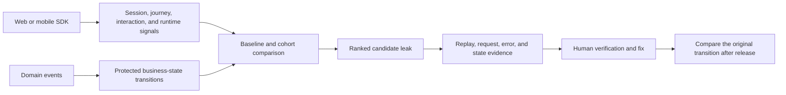

<p align="center">
  
</p>

<h1 align="center">Rejourney</h1>

<p align="center"><strong>Revenue-leak prediction for web and mobile products.</strong></p>

<p align="center"><a href="https://rejourney.co"><strong>Explore the website →</strong></a></p>


<p align="center">
  <sub><strong>SUPPORTED PLATFORMS</strong></sub>
</p>

<p align="center">
  <a href="https://nextjs.org"></a>
  <a href="https://reactnative.dev"></a>
  <a href="https://www.swift.org"></a>
  <a href="https://nuxt.com"></a>
  <a href="https://angular.dev"></a>
  <a href="https://svelte.dev"></a>
</p>

<p align="center">
  <a href="https://remix.run"></a>
  <a href="https://www.gatsbyjs.com"></a>
  <a href="https://www.shopify.com"></a>
  <a href="https://hydrogen.shopify.dev"></a>
</p>

Rejourney finds product failures that may be costing revenue. You define the
business transition to protect: activation, checkout, purchase validation,
entitlement, or renewal. Rejourney compares the current cohort with a healthy
baseline and groups the evidence around the change.


## Session replay is the investigative surface

Session replay is central to the workflow. A conversion drop identifies a
transition worth checking; the recording shows the path to that transition,
what the user tried, whether the UI acknowledged it, and the errors or slow
requests in the same session. Reviewers can compare affected sessions with
successful sessions from the same release, device, route, or campaign.

The result is a candidate leak with a cohort, a baseline, supporting signals,
and sessions to inspect. It becomes a confirmed product or revenue problem only
after the relevant application and business state have been checked.

## Investigation toolbox

The issue feed points to a cohort. These views are used to narrow down what
changed and where to look next.

### Journeys and interaction

Journey maps show the routes through a flow. Heatmaps expose the interaction
pattern on the screen: repeated taps, missed targets, or controls that receive
little attention. Use both when the failure is visible in the interface but the
cause is not yet clear.


### API, crash, and stability context

Endpoint views break down request volume, errors, latency, and status codes.
Crash and ANR detail adds the app version, device, and thread context around a
failure. This is where a problematic UI transition can be connected to a
backend or runtime condition.


### Device and geographic cohorts

Device views make version, operating-system, and hardware concentrations
visible. Geographic views help separate a global regression from an issue tied
to a region or network path.


## General analytics and revenue context

The replay and investigation views sit alongside the project-level context that
helps decide whether a change is isolated or broad. The overview combines
version adoption, engagement mix, stability, time in product, retention, and
cohorts. The events view shows the business events behind a flow and the users
who generated them. When a revenue source is connected, the revenue view keeps
transactions, refunds, subscribers, and the revenue trend in the same review.

Open an image for the full-resolution capture.

<table>
  <tr>
    <td width="50%" valign="top">
      <a href="dashboard/web-ui/public/images/readme/analytics-overview.png"></a><br />
      <sub>Version adoption, engagement, stability, retention, and cohorts.</sub>
    </td>
    <td width="50%" valign="top">
      <a href="dashboard/web-ui/public/images/readme/custom-events.png"></a><br />
      <sub>Custom events and the users behind them.</sub>
    </td>
  </tr>
  <tr>
    <td colspan="2">
      <a href="dashboard/web-ui/public/images/readme/revenue-impact.png"></a><br />
      <sub>Revenue, refunds, subscribers, and the revenue trend for a connected source.</sub>
    </td>
  </tr>
</table>

## What Rejourney looks for

Revenue is an outcome, not a useful unit of diagnosis. Rejourney protects
explicit business states such as:

- signup and first-value activation;
- checkout start, payment confirmation, and order creation;
- trial start, subscription, renewal, and cancellation recovery; and
- purchase validation and entitlement delivery in mobile apps.

For each state, the analysis starts with an eligible population and asks whether
failure has increased beyond a comparable healthy population. It uses leading
signals: journey changes, repeated interaction, request failures, runtime
errors, crashes/ANRs, and state contradictions. These signals rank the risk
before a lagging aggregate may make it obvious.

```text
eligible session -> intended action -> request / product state
                 -> visible confirmation -> protected business outcome
```

The lead time depends on the transition. A checkout confirmation failure can be
actionable immediately. A retention risk may only be confirmed after the chosen
return or renewal window. There is no universal revenue score or fixed lead
time.

## From an event to an investigation

### Instrument the protected states

The SDKs capture session, route/screen, interaction, and technical context.
Add stable, domain-level events for the states that establish intent and a
successful outcome. For example:

```ts
Rejourney.logEvent('checkout_started', {
  orderId: 'order_123',
  amount: 49,
  currency: 'USD',
});

Rejourney.logEvent('purchase_completed', {
  orderId: 'order_123',
  transactionId: 'txn_456',
  amount: 49,
  currency: 'USD',
});
```

Use internal user identifiers where identification is needed; do not send raw
PII, payment credentials, secrets, or sensitive application payloads. The
transaction/order identifiers and monetary fields above are optional event
properties. They do not replace a financial ledger.

### Compare each cohort with a baseline

The basic population estimate is:

```text
excess failed intent = eligible attempts × (current failure rate - healthy failure rate)
potential impact     = excess failed intent × historical completion value
```

The baseline must match the transition and context: release, platform, route or
screen, device, region, campaign, experiment, and time window where relevant.
Potential impact is an estimate, not booked or recovered revenue. Keep it
separate from evidence confidence. High traffic alone does not justify a
financial claim.

### Read the evidence in context

Candidate leaks are investigated with signal families that fail differently:

| Signal family | Examples | What it establishes |
| --- | --- | --- |
| Journey and funnel | transition loss, loops, longer time to success | where intent stopped progressing |
| Interaction and replay | repeated taps, dead clicks, form resubmits, pauses | what the user experienced |
| Runtime and network | request failures/latency, exceptions, crashes, ANRs | technical conditions around the failure |
| Business state | payment, order, subscription, entitlement, renewal events | whether the protected state actually occurred |

An event drop identifies a cohort. Replay describes an experience. Payment or
entitlement state can confirm that the protected outcome failed. An unexplained
exit remains an investigation until more evidence appears.

### Review the candidate

A candidate records the protected transition, affected users and sessions,
baseline and excess failure, first and last seen time, release and segment
concentration, technical signals, and representative healthy and failed
sessions. Product and engineering can then test a specific hypothesis.



## Web capture benchmark

The checked-in benchmark measures web SDK capture overhead. It does not measure
revenue-leak prediction accuracy. It compares the Rejourney browser SDK with PostHog on the
same scripted flow in local Next.js, SvelteKit, and Nuxt fixtures. Both SDKs
send to configured live project endpoints; browser measurements are collected
through Playwright and Chrome DevTools Protocol.

The published run used Chromium at `1365×768`, three iterations per
framework/mode, and this shared flow: load, form edits, custom event, identity
and metadata, request, route transition, synthetic error, missing resource,
scroll, and an 85 ms controlled long task. It is a small sample and should be
rerun before applying its results to another application.

| Fixture | Rejourney upload | PostHog upload | Rejourney task time | PostHog task time | Rejourney script time | PostHog script time | Rejourney final heap | PostHog final heap |
| --- | ---: | ---: | ---: | ---: | ---: | ---: | ---: | ---: |
| Next.js | 21.29 KiB | 45.35 KiB | 417.96 ms | 449.91 ms | 160.46 ms | 185.06 ms | 15.81 MiB | 16.19 MiB |
| SvelteKit | 8.38 KiB | 24.99 KiB | 268.72 ms | 304.03 ms | 19.35 ms | 42.02 ms | 6.63 MiB | 9.17 MiB |
| Nuxt | 8.40 KiB | 26.57 KiB | 305.51 ms | 322.24 ms | 21.12 ms | 41.17 ms | 11.33 MiB | 15.44 MiB |

`TaskDuration` is Chrome's main-thread busy-time proxy over the complete
scripted visit, including the fixed flush wait. The figures are per-fixture
medians from the published report. They are not a latency SLA.

Evidence and methodology:

- [benchmark README](benchmarks/web-analytics/README.md)
- [published report](benchmarks/web-analytics/results/2026-05-19T03-47-21-774Z/benchmark-report.md)
- [redacted raw results](benchmarks/web-analytics/results/2026-05-19T03-47-21-774Z/benchmark-results.json)
- [benchmark runner](benchmarks/web-analytics/run-web-analytics-benchmark.mjs)

## Mobile SDK measurements

The mobile comparison records package footprint against Sentry at the versions
below. Transfer size comes from Bundlephobia. It measures packages, not a
complete mobile application.

| Package | Version | Minified | Gzipped |
| --- | ---: | ---: | ---: |
| `@rejourneyco/react-native` | `1.0.17` | 39.7 kB | 13.2 kB |
| `@sentry/react-native` | `8.7.0` | 403 kB | 135.3 kB |

Sources: [`@rejourneyco/react-native` on Bundlephobia](https://bundlephobia.com/package/@rejourneyco/react-native@1.0.17) and [`@sentry/react-native` on Bundlephobia](https://bundlephobia.com/package/@sentry/react-native@8.7.0).

The recorded Rejourney capture measurement used an iPhone 15 Pro on iOS 26,
Expo SDK 54, the React Native New Architecture, and a production app with
Mapbox Metal and Firebase. The workload had 46 complex feed items, a Mapbox GL
view, 124 API calls, 31 subcomponents, active gesture tracking, and privacy
redaction.

| Capture stage | Average | Maximum | Minimum | Execution context |
| --- | ---: | ---: | ---: | --- |
| UIKit + Metal capture | 12.4 ms | 28.2 ms | 8.1 ms | Main thread |
| Async image processing | 42.5 ms | 88.0 ms | 32.4 ms | Background |
| Tar + gzip compression | 14.2 ms | 32.5 ms | 9.6 ms | Background |
| Upload handshake | 0.8 ms | 2.4 ms | 0.3 ms | Background |

Only UIKit + Metal capture runs on the main thread. These numbers describe the
recorded workload. They are not a general mobile-performance or Sentry-runtime
comparison.

## Quick integration

### Web

```bash
npm install @rejourneyco/browser
```

```ts
import { Rejourney } from '@rejourneyco/browser';

await Rejourney.init('pk_live_your_public_key');
await Rejourney.start();
```

Call `start()` after consent when your site requires it. Add the application
domain to **Allowed Domains** in Project Settings; web recording does not start
until it is allowed. The browser SDK documentation covers framework-specific
entry points, route naming, identity, and privacy-sensitive settings:
[web getting started](docs/web/getting-started.md).

### React Native

```bash
npm install @rejourneyco/react-native
```

```ts
import { Rejourney } from '@rejourneyco/react-native';

Rejourney.init('pk_live_your_public_key');
Rejourney.start();
```

React Native requires native code and does not run in Expo Go. See
[React Native getting started](docs/react-native/getting-started.md) for
navigation tracking, session controls, event naming, and mobile privacy
settings.

### Swift

In Xcode, choose **File → Add Package Dependencies** and add:

```text
https://github.com/rejourneyco/rejourney
```

Rejourney requires iOS 15.1 or later.

```swift
import SwiftUI
import Rejourney

@main
struct MyApp: App {
    @MainActor
    init() {
        Rejourney.configure(publicKey: "rj_your_public_key")
        Task { await Rejourney.start() }
    }

    var body: some Scene {
        WindowGroup { ContentView() }
    }
}
```

See [iOS getting started](docs/ios/getting-started.md) for screen tracking,
identity, event capture, and recording controls.

## Limits, privacy, and verification

- A ranked signal does not establish causality. Inspect representative sessions
  and the authoritative business state before treating it as a revenue leak.
- Define an outcome, require enough volume, and choose a comparable baseline.
  An abandonment, error, or replay anomaly can have other explanations.
- Re-check the original cohort after releases, pricing changes, experiments,
  seasonal shifts, or instrumentation changes.
- Payments, subscriptions, entitlements, and booked revenue remain in the
  commercial system of record.
- Configure consent, capture controls, sampling, allowed domains, and masking.
  Do not send PII, credentials, payment data, or secrets in events or logs.

## Development and deployment

For a local development environment, start with
[local Kubernetes development](local-k8s/README.md). For single-node
self-hosting, use the checked-in [self-hosted guide](docs/selfhosted/README.md).
Architecture and deployment references are available in
[the architecture documentation](docs/architecture/).

## License

Client-side components (SDKs and CLIs) are licensed under Apache 2.0.
Server-side components (backend and dashboard) are licensed under SSPL 1.0.
See [LICENSE-APACHE](LICENSE-APACHE) and [LICENSE-SSPL](LICENSE-SSPL).
