<p align="center">
  
</p>

<h1 align="center">Rejourney</h1>

<p align="center"><strong>Find and fix conversion issues before they cost you users.</strong></p>

<p align="center">
  <a href="https://rejourney.co"><strong>Website</strong></a> ·
  <a href="https://www.youtube.com/watch?v=Z95MDxBXMjk"><strong>Silly Demo (With Cats)</strong></a>
</p>

Rejourney is an open-source platform for finding problems in web and mobile
user journeys before they become larger conversion, retention, or revenue
problems. It combines session replay, the business events you define, and
technical context such as request failures, crashes, and ANRs to surface
patterns worth investigating.

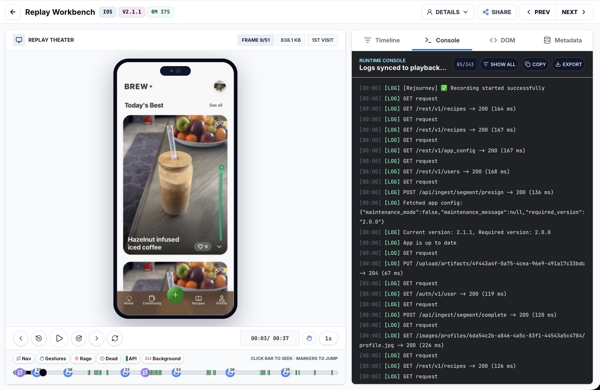

<p align="center">
  <sub><strong>SUPPORTED PLATFORMS</strong></sub>
</p>

<p align="center">
  <a href="https://nextjs.org"></a>
  <a href="https://rejourney.co/docs/web/getting-started#redux-and-redux-toolkit"></a>
  <a href="https://reactnative.dev"></a>
  <a href="https://www.swift.org"></a>
  <a href="https://nuxt.com"></a>
  <a href="https://angular.dev"></a>
  <a href="https://svelte.dev"></a>
</p>

<p align="center">
  <a href="https://remix.run"></a>
  <a href="https://www.gatsbyjs.com"></a>
  <a href="https://www.shopify.com"></a>
  <a href="https://hydrogen.shopify.dev"></a>
</p>

## How it works

1. Install a Rejourney SDK in your web, Swift, or React Native app.
2. Track the few product events that matter most to your business, such as a
   completed signup, subscription purchase, or successful checkout. These are
   your **critical conversion events**.
3. Rejourney records the surrounding user journey and interaction data, then
   connects it with the events and technical signals from that session.
4. Similar sessions are grouped into cohorts. When a cohort shows a worrying
   trend around a critical conversion event, Rejourney brings the replays and
   evidence forward for analysis.
5. The result is an issue report with the relevant context and a suggested fix
   that your team can review and use in its development workflow. Connecting a
   GitHub repository can add code context and a proposed code change.

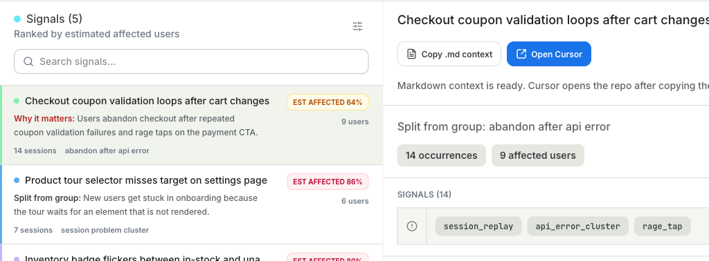

## What Rejourney captures

Rejourney relates the outcome you care about to what happened before it. The
SDKs collect session, route or screen, interaction, and event context. That
includes touches, scrolls, pans, repeated or rage taps, and the sequence of the
user journey. When available, it also adds the technical evidence that makes an
issue easier to diagnose: API response times and status codes, errors, crash
traces, and ANRs.

### Replays, journeys, and interaction patterns

Session replay shows the actual path a person took through a flow. Journey maps
and heatmaps make it easier to compare paths, spot loops, and see where people
try to interact with an unresponsive or confusing part of the interface.

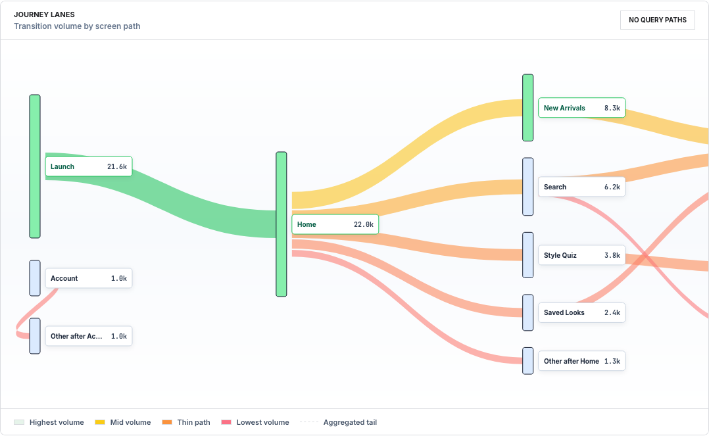

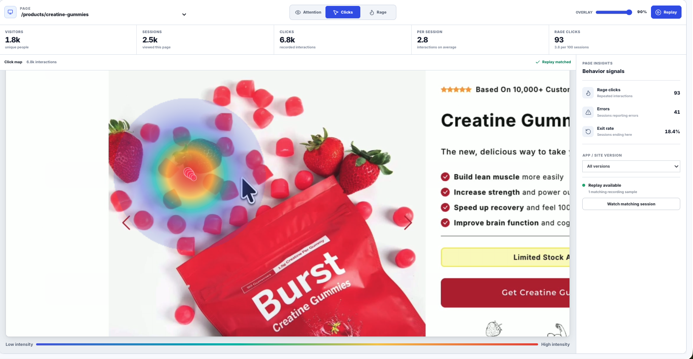

### API, crashes, and stability context

Replay alone does not explain every problem. Endpoint views show latency,
errors, and status-code breakdowns. Crash and ANR detail adds the app version,
device, and runtime context around a failure, helping connect a broken flow to
the technical condition behind it.

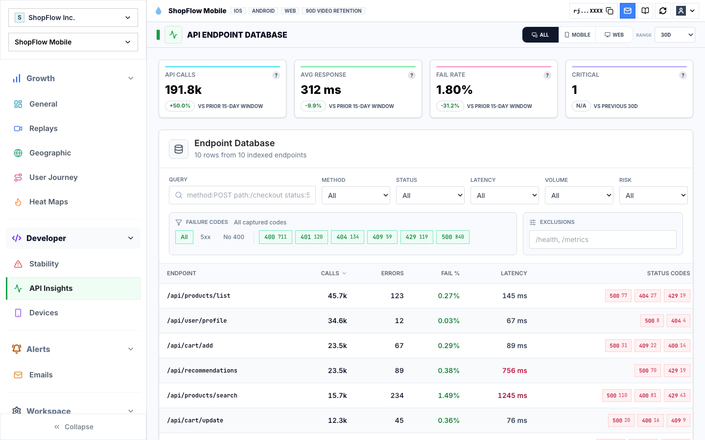

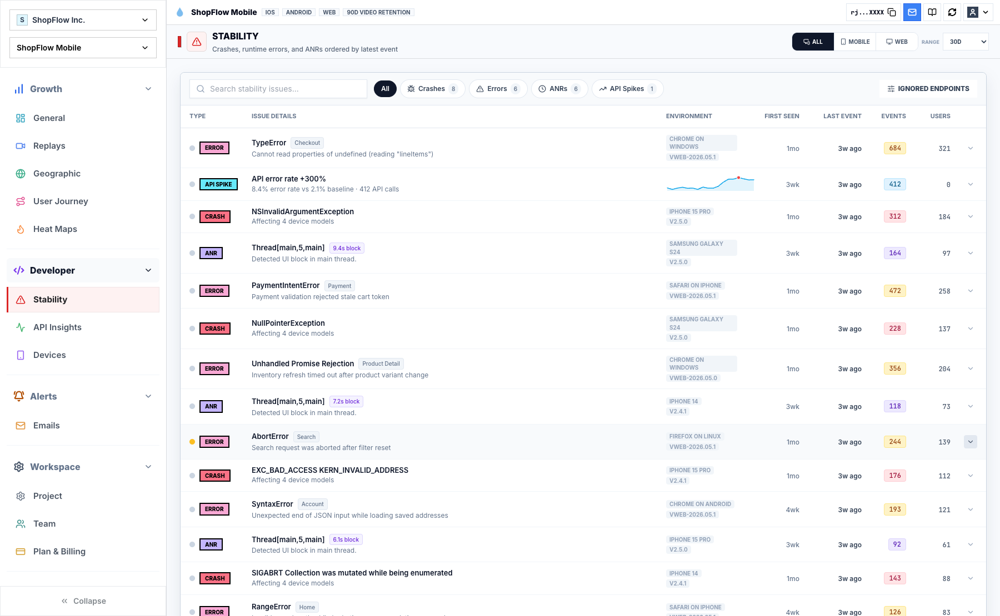

### Device and geographic cohorts

Filter a cohort by app version, operating system, device, geography, and other
context to distinguish a broad regression from a problem limited to a release,
device family, region, or network path.

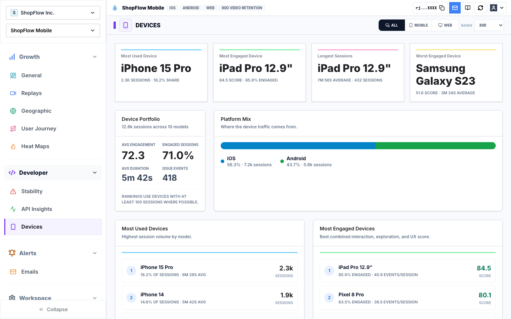

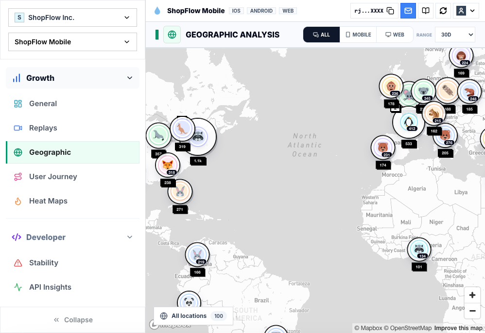

## Analytics and revenue context

The replay and issue views sit alongside project-level analytics: version
adoption, engagement, stability, retention, cohorts, custom events, and—when a
revenue source is connected—transactions, refunds, subscribers, and trends.
Open an image for the full-resolution capture.

<table>
  <tr>
    <td width="50%" valign="top">
      <a href="dashboard/web-ui/public/images/readme/analytics-overview.png">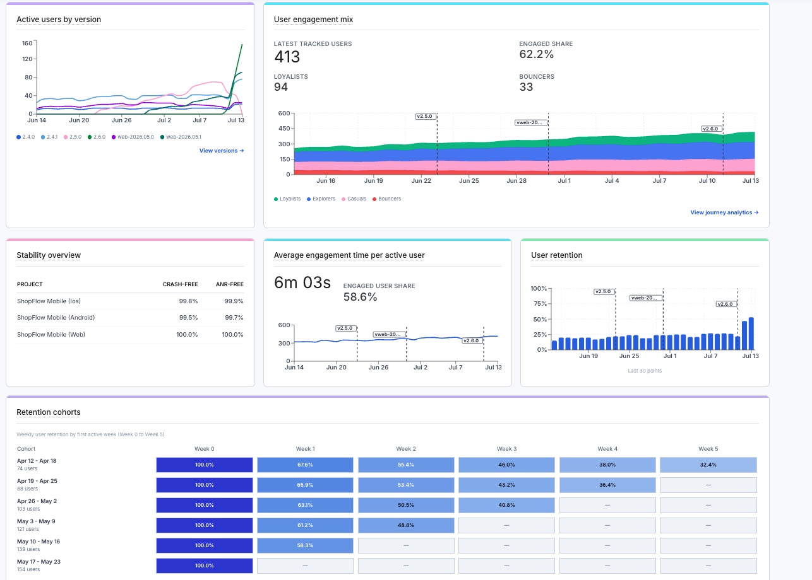</a><br />
      <sub>Version adoption, engagement, stability, retention, and cohorts.</sub>
    </td>
    <td width="50%" valign="top">
      <a href="dashboard/web-ui/public/images/readme/custom-events.png">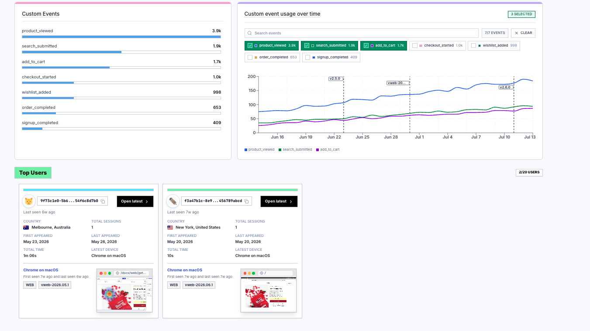</a><br />
      <sub>Custom events and the users behind them.</sub>
    </td>
  </tr>
  <tr>
    <td colspan="2">
      <a href="dashboard/web-ui/public/images/readme/revenue-impact.png">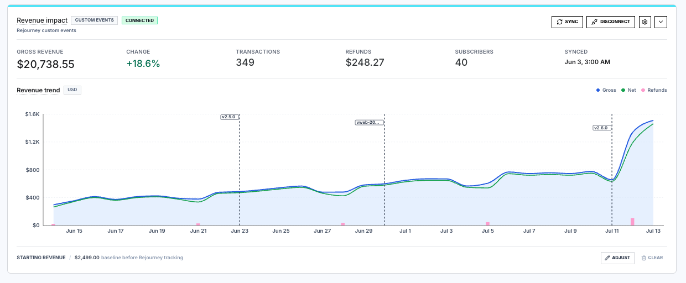</a><br />
      <sub>Revenue, refunds, subscribers, and the revenue trend for a connected source.</sub>
    </td>
  </tr>
</table>

## Track critical conversion events

Track stable, domain-level events for the actions that establish intent and a
successful outcome. For example, a checkout flow might use `checkout_started`
and `purchase_completed`:

```ts
Rejourney.logEvent('checkout_started', {
  orderId: 'order_123',
  amount: 49,
  currency: 'USD',
});

Rejourney.logEvent('purchase_completed', {
  orderId: 'order_123',
  transactionId: 'txn_456',
  amount: 49,
  currency: 'USD',
});
```

Rejourney uses these events to compare journeys and outcomes across similar
sessions. A reported pattern is a starting point for investigation, not proof
of causality: review the representative replays and your authoritative product
or payment state before shipping a fix.

## Quick integration

### Web

```bash
npm install @rejourneyco/browser
```

```ts
import { Rejourney } from '@rejourneyco/browser';

await Rejourney.init('pk_live_your_public_key');
await Rejourney.start();
```

Call `start()` after consent when your site requires it. Add the application
domain to **Allowed Domains** in Project Settings; web recording does not start
until it is allowed. See [web getting started](docs/web/getting-started.md) for
framework-specific entry points, route naming, identity, and privacy settings.

### React Native

```bash
npm install @rejourneyco/react-native
```

```ts
import { Rejourney } from '@rejourneyco/react-native';

Rejourney.init('pk_live_your_public_key');
Rejourney.start();
```

React Native requires native code and does not run in Expo Go. See
[React Native getting started](docs/react-native/getting-started.md) for
navigation tracking, session controls, event naming, and privacy settings.

### Swift

In Xcode, choose **File → Add Package Dependencies** and add:

```text
https://github.com/rejourneyco/rejourney
```

Rejourney requires iOS 15.1 or later.

```swift
import SwiftUI
import Rejourney

@main
struct MyApp: App {
    @MainActor
    init() {
        Rejourney.configure(publicKey: "rj_your_public_key")
        Task { await Rejourney.start() }
    }

    var body: some Scene {
        WindowGroup { ContentView() }
    }
}
```

See [iOS getting started](docs/ios/getting-started.md) for screen tracking,
identity, event capture, and recording controls.

## Privacy and data handling

Privacy is a core consideration when recording user sessions. Configure consent,
capture controls, sampling, allowed domains, and masking for your product. Do
not send PII, credentials, payment data, secrets, or sensitive application
payloads in events or logs.

Rejourney is designed for short recording retention periods—commonly seven
days. After the retention window, recordings are quantized, fingerprints are
anonymized, and the retained data is aggregated into general dashboard
analytics. Make sure your configuration and policies meet the privacy and GDPR
requirements that apply to your users.

## Performance measurements

The checked-in web benchmark compares the Rejourney browser SDK with PostHog on
the same scripted flow in local Next.js, SvelteKit, and Nuxt fixtures. It
measures SDK capture overhead, not issue-detection accuracy or a latency SLA.

| Fixture | Rejourney upload | PostHog upload | Rejourney task time | PostHog task time | Rejourney script time | PostHog script time | Rejourney final heap | PostHog final heap |
| --- | ---: | ---: | ---: | ---: | ---: | ---: | ---: | ---: |
| Next.js | 21.29 KiB | 45.35 KiB | 417.96 ms | 449.91 ms | 160.46 ms | 185.06 ms | 15.81 MiB | 16.19 MiB |
| SvelteKit | 8.38 KiB | 24.99 KiB | 268.72 ms | 304.03 ms | 19.35 ms | 42.02 ms | 6.63 MiB | 9.17 MiB |
| Nuxt | 8.40 KiB | 26.57 KiB | 305.51 ms | 322.24 ms | 21.12 ms | 41.17 ms | 11.33 MiB | 15.44 MiB |

The published run used Chromium at `1365×768`, three iterations per
framework/mode, and a shared flow that included navigation, form edits, events,
requests, errors, scrolling, and a controlled long task. Rerun it before
applying these results to a different application.

- [Benchmark README](benchmarks/web-analytics/README.md)
- [Published report](benchmarks/web-analytics/results/2026-05-19T03-47-21-774Z/benchmark-report.md)
- [Redacted raw results](benchmarks/web-analytics/results/2026-05-19T03-47-21-774Z/benchmark-results.json)
- [Benchmark runner](benchmarks/web-analytics/run-web-analytics-benchmark.mjs)

The mobile comparison records package footprint against Sentry. It measures
packages rather than a complete mobile application.

| Package | Version | Minified | Gzipped |
| --- | ---: | ---: | ---: |
| `@rejourneyco/react-native` | `1.0.17` | 39.7 kB | 13.2 kB |
| `@sentry/react-native` | `8.7.0` | 403 kB | 135.3 kB |

Sources: [`@rejourneyco/react-native` on Bundlephobia](https://bundlephobia.com/package/@rejourneyco/react-native@1.0.17) and [`@sentry/react-native` on Bundlephobia](https://bundlephobia.com/package/@sentry/react-native@8.7.0).

The recorded Rejourney capture measurement used an iPhone 15 Pro on iOS 26,
Expo SDK 54, the React Native New Architecture, and a production app with
Mapbox Metal and Firebase.

| Capture stage | Average | Maximum | Minimum | Execution context |
| --- | ---: | ---: | ---: | --- |
| UIKit + Metal capture | 12.4 ms | 28.2 ms | 8.1 ms | Main thread |
| Async image processing | 42.5 ms | 88.0 ms | 32.4 ms | Background |
| Tar + gzip compression | 14.2 ms | 32.5 ms | 9.6 ms | Background |
| Upload handshake | 0.8 ms | 2.4 ms | 0.3 ms | Background |

Only UIKit + Metal capture runs on the main thread. These measurements describe
the recorded workload; they are not a general mobile-performance comparison.

## Development and deployment

For a local development environment, start with
[local Kubernetes development](local-k8s/README.md). For single-node
self-hosting, use the [self-hosted guide](docs/selfhosted/README.md).
Architecture and deployment references are in
[the architecture documentation](docs/architecture/).

## License

Client-side components (SDKs and CLIs) are licensed under Apache 2.0.
Server-side components (backend and dashboard) are licensed under SSPL 1.0.
See [LICENSE-APACHE](LICENSE-APACHE) and [LICENSE-SSPL](LICENSE-SSPL).
