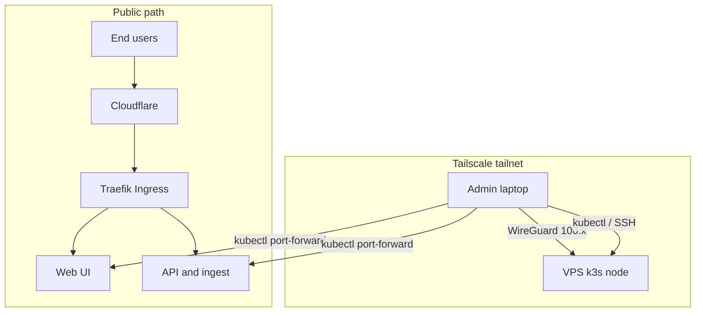

## Tailscale, public traffic, and admin access

**Public path (unchanged):** Internet → **Cloudflare** (DNS / TLS / WAF) → **Traefik** on k3s → `rejourney.co`, `api.rejourney.co`, `ingest.rejourney.co`.

**Admin path:** Operators join the **Tailscale tailnet** (Mac + VPS). They use **SSH** and **`kubectl`** over **100.x** addresses. **Admin UIs** (pgweb, Redis Commander, Netdata, Traefik dashboard, Uptime Kuma) have **no public Ingress**; open them with **`kubectl port-forward`** to `127.0.0.1` on the laptop. The **internal dashboard** repo (`rejourney-internal`) talks to Postgres/S3 the same way: tunnels + local Node.



**Docs:** [network-exposure-and-tailscale.md](./network-exposure-and-tailscale.md), [admin-tools-private-access.md](./admin-tools-private-access.md), sibling repo `rejourney-internal/dev_docs/`.

---

Deployment:
┌──────────────┐      ┌─────────────────────────────┐      ┌─────────────────┐
│  GitHub Repo │─────▶│      GitHub Actions         │─────▶│      GHCR       │
│ (rejourney)  │      │   (Force Deploy VPS)        │      │ (Docker Images) │
└──────────────┘      └──────────────┬──────────────┘      └────────┬────────┘
                                     │                              │
                                     │ 2) kubectl apply             │ 3) Pull
                                     │    manifests                 │    Images
                                     ▼                              ▼
                      ┌────────────────────────────────────────────────────┐
                      │             Hetzner VPS Cluster (k3s)              │
                      │                namespace: rejourney                │
                      └────────────────────────────────────────────────────┘


K3s Details:

┌──────────────────────────────────────────────────────────────────────────────┐
│                           Kubernetes Cluster (k3s)                           │
│                                                                              │
│  ┌────────────────────────┐          ┌────────────────────────────────────┐  │
│  │      Networking        │          │            Entrypoints             │  │
│  │ ┌──────────────────┐   │          │  ┌──────────┐        ┌──────────┐  │  │
│  │ │ Traefik Ingress  │◀──┼──────────┼──┤  Web UI  │        │ API+ingest│  │  │
│  │ └─────────┬────────┘   │          │  │  (Node)  │        │ Backend  │  │  │
│  └───────────┼────────────┘          │  └──────────┘        └────┬─────┘  │  │
│              │                       └───────────────────────────┼────────┘  │
│              │                                                   │           │
│  ┌───────────▼────────────┐          ┌───────────────────────────▼────────┐  │
│  │      Monitoring        │          │           Storage Layer            │  │
│  │ ┌──────────────────┐   │          │  ┌──────────┐        ┌──────────┐  │  │
│  │ │ Netdata (admin   │   │          │  │ Postgres │        │  Redis   │  │  │
│  │ │  port-forward)   │   │          │  │          │        │          │  │  │
│  │ └──────────────────┘   │          │  │ (PVC 20G)│        │ (In-Mem) │  │  │
│  └────────────────────────┘          │  └──────────┘        └──────────┘  │  │
│                                      └────────────────────────────────────┘  │
│                                                                              │
│  ┌────────────────────────────────────────────────────────────────────────┐  │
│  │                     Background workers (Deployments)                   │  │
│  │  ┌──────────────────┐  ┌──────────────────┐  ┌──────────────────────────┐  │  │
│  │  │ ingest-worker    │  │ replay-worker    │  │ session-lifecycle-worker │  │  │
│  │  │ events, crashes, │  │ screenshots,     │  │ lifecycle sweeps +       │  │  │
│  │  │ ANRs             │  │ hierarchy        │  │ session reconcile        │  │  │
│  │  └────────┬─────────┘  └────────┬─────────┘  └────────────┬─────────────┘  │  │
│  │           │                   │                         │              │  │
│  │           └───────────────────┴─────────────────────────┘              │  │
│  │                                   │                                       │  │
│  │  ┌──────────────────┐             │  CronJobs (on schedule)               │  │
│  │  │ alert-worker     │             │  retention-worker · session-backup ·  │  │
│  │  │ (alert pipeline) │             │  postgres-backup                      │  │
│  │  └──────────────────┘             │                                       │  │
│  └────────────────────────────────────────────────────────────────────────┘  │
└──────────────────────────────────────────────────────────────────────────────┘

                    (ingest pathway detail below: SDK → API → storage → queue → workers)


Ingest pathway (workers + data plane):

```text
┌─────────────┐   presign / complete / relay    ┌─────────────────────────────────────┐
│ JS / native │ ───────────────────────────────▶│ API (+ ingest routes)               │
│ SDK         │                                 │ sessions · recording_artifacts ·   │
└─────────────┘                                 │ metrics · ingest_jobs               │
       │                                        └───────────────┬─────────────────────┘
       │                                                        │
       │  PUT uploads (relay)                                     │ enqueue + state
       ▼                                                        ▼
┌─────────────┐   object payloads                      ┌────────────────┐
│ Hetzner S3  │ ◀──────────────────────────────────────│ Postgres     │
│ (artifacts) │                                        │ (source of   │
└──────┬──────┘                                        │  truth)      │
       │                                               └───────┬────────┘
       │                                                       │
       │                                                       │ job rows / locks
       ▼                                                       ▼
┌──────────────────────────────────────────────────────────────────────────────┐
│ Redis — cache, idempotency, ingest job coordination, worker-side limits     │
└───────────────────────────────┬──────────────────────────────────────────────┘
                                │
        ┌───────────────────────┼───────────────────────┐
        ▼                       ▼                       ▼
┌───────────────┐     ┌─────────────────┐     ┌──────────────────────────┐
│ ingest-worker │     │ replay-worker   │     │ session-lifecycle-worker │
│ drain jobs:   │     │ drain jobs:     │     │ sweeps + session         │
│ events,       │     │ screenshots,    │     │ reconciliation           │
│ crashes, ANRs │     │ hierarchy       │     │                          │
└───────┬───────┘     └────────┬────────┘     └────────────┬─────────────┘
        │                      │                        │
        └──────────────────────┴────────────────────────┘
                               │
                               ▼
                    updates artifacts, sessions, replay readiness,
                    lifecycle flags (still Postgres + S3 as above)
```

External Beyond:

Admins: **Tailscale** (100.x) → SSH / `kubectl` / `port-forward` (not through Cloudflare).

                        ┌────────────────────────┐
                        │       Cloudflare       │
                        │   (DNS / SSL / public) │
                        └────────────┬───────────┘
                                     │
                        ┌────────────▼───────────┐
                        │     Traefik (k8s)      │
                        └────────────┬───────────┘
                                     │
              ┌──────────────────────┴───────────────────────┐
              │                                              │
      ┌───────▼────────┐                             ┌───────▼────────┐
      │     Web UI     │                             │   API Backend  │
      └────────────────┘                             └───────┬────────┘
                                                             │
        ┌─────────────────┬─────────────────┬────────────────┴──────────┐
        │                 │                 │                           │
┌───────▼───────┐ ┌───────▼───────┐ ┌───────▼────────┐        ┌─────────▼────────┐
│   Postgres    │ │     Redis     │ │  Hetzner S3   │        │   External APIs   │
│ (Main Data)   │ │ cache / queue │ │ (Recordings)  │        │  (Stripe / SMTP)  │
│               │ │ ingest jobs   │ │               │        │                   │
└───────▲───────┘ └───────▲───────┘ └───────▲───────┘        └────────────────────┘
        │                 │                 │
        └─────────────────┴─────────────────┘
              ingest · replay · session-lifecycle · alert workers
              (drain queues, update sessions/artifacts, alerts)


Session Backup Deployment Notes:

- The session backup CronJob is deployed from [archive.yaml](../k8s/archive.yaml).
- Production currently schedules that CronJob hourly so queued backupable sessions do not wait for a once-daily drain.
- The source-of-truth script for that job is [session-backup.mjs](../scripts/k8s/session-backup.mjs), and GitHub Actions now runs [check-archive-sync.sh](../scripts/k8s/check-archive-sync.sh) before `kubectl apply`.
- A deploy from `main` now updates the backup job logic, including legacy hierarchy gzip repair and archive-friendly screenshot repacking for R2.
- The live CronJob can be suspended during reset, but the committed manifest controls whether it resumes after the next deploy.
- Detailed queue / backup / retention rules live in [Session Backup + Retention Internals](./session-backup-retention-internals.md).

Current Production Runtime Notes:

- Long-running deployments:
  - API
  - Web UI
  - `ingest-worker` ([`ingestArtifactWorker.js`](../backend/src/worker/ingestArtifactWorker.ts) — events, crashes, ANRs)
  - `replay-worker` ([`replayArtifactWorker.js`](../backend/src/worker/replayArtifactWorker.ts) — screenshots, hierarchy)
  - `session-lifecycle-worker` ([`sessionLifecycleWorker.js`](../backend/src/worker/sessionLifecycleWorker.ts) — lifecycle sweeps, session reconciliation)
  - `alert-worker`
- CronJobs:
  - `session-backup` in [archive.yaml](../k8s/archive.yaml)
  - `retention-worker` in [workers.yaml](../k8s/workers.yaml)
  - `postgres-backup` in [backup.yaml](../k8s/backup.yaml)
- There is no separate billing worker anymore. Billing is handled by Stripe webhooks through the API.

Retention + Backup Coordination:

- Production retention now runs as a CronJob every 15 minutes with `concurrencyPolicy: Forbid`.
- The container entrypoint is `node dist/worker/retentionWorker.js --once --drain-backlog --trigger=scheduled`.
- Retention also takes a Postgres run lock in `retention_run_lock`, so a manual backfill and the CronJob cannot overlap.
- Retention only purges a session after backup safety checks pass:
  - normally that means a complete `session_backup_log` row exists
  - truly empty sessions are the intentional exception and may be purged outright
- This means retention is intentionally fail-safe on fresh deploys:
  - if `session_backup_log` does not exist yet, retention skips session purges
  - if a session has not been backed up yet, retention skips that session
- Backup is the source that creates and populates `session_backup_log`, so backup must run successfully before retention can start draining expired sessions.
- Retention deletes only the session artifact payloads and cache state:
  - canonical S3 objects under `tenant/{teamId}/project/{projectId}/sessions/{sessionId}/...`
  - legacy disconnected objects under bare `sessions/...`
  - `recording_artifacts` rows
  - `ingest_jobs` rows
  - replay/cache state on the `sessions` row
- Retention keeps the `sessions` row and other analytics/fault data.
- Every purge attempt is logged to `retention_deletion_log`.

Operational Commands:

- Apply schema changes before enabling the new retention behavior:
  - `cd backend && npm run db:migrate`
- Manually drain the backlog once the backup job has populated `session_backup_log`:
  - `cd backend && npm run retention:backfill:expired-artifacts`
- Useful things to inspect during rollout:
  - `retention_deletion_log` for what was deleted or skipped
  - `retention_run_lock` for active retention runs
  - `session_backup_log` to confirm backup eligibility
  - Redis key `retentionWorker:last_summary` for the latest retention cycle summary
