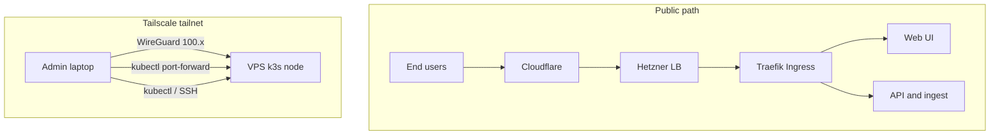

# All Things Cloud

Last updated: 2026-04-22

This is the operator-facing map of production: network path, deploy flow, storage layout, monitoring, backups, and the runtime services we actually have today.

## Tailscale, public traffic, and admin access

**Public path:** Internet -> **Cloudflare** (DNS / TLS / WAF) -> **Hetzner Load Balancer** (PROXY protocol) -> **Traefik** on k3s -> `rejourney.co`, `api.rejourney.co`, `ingest.rejourney.co`

**Admin path:** Operators join the **Tailscale tailnet** and use **SSH**, **kubectl**, and **kubectl port-forward** over `100.x` addresses. Admin UIs are not public anymore.

**Important boundary:** Tailscale protects operator access to the node and cluster. It is not in the normal in-cluster service path. Internal traffic such as `Grafana -> VictoriaMetrics` or `postgres-exporter -> postgres-app-rw` stays on Kubernetes service networking.



Related docs:

- [admin-tools-private-access.md](./admin-tools-private-access.md)
- [rejourney-ci.md](./rejourney-ci.md)
- [legacy.md](./legacy.md)
- [postgres-backup-and-restore.md](./postgres-backup-and-restore.md)
- sibling repo `rejourney-internal/dev_docs/`

## Deployment

```text
┌──────────────┐      ┌─────────────────────────────┐      ┌─────────────────┐
│  GitHub Repo │─────▶│      GitHub Actions         │─────▶│      GHCR       │
│ (rejourney)  │      │  scripts/k8s/deploy-release │      │ (Docker Images) │
└──────────────┘      └──────────────┬──────────────┘      └────────┬────────┘
                                     │                              │
                                     │ render + kubectl apply       │ pull
                                     ▼                              ▼
                      ┌────────────────────────────────────────────────────┐
                      │         Hetzner CPX42 k3s node (single)            │
                      │                namespace: rejourney                │
                      └────────────────────────────────────────────────────┘
```

`deploy-release.sh` does all of the following now:

- renders `k8s/*.yaml` into a temp dir with image-tag substitution
- applies `namespace.yaml`, `traefik-config.yaml`, `exporters.yaml`, `ingress.yaml`, and `storage-class-db-local.yaml` up front
- applies `k8s/cnpg/postgres-cnpg.yaml` explicitly in its own CNPG step
- server-side applies `k8s/grafana-dashboards.yaml` because the ConfigMap is too large for client-side apply annotations
- bulk-applies the rendered root manifests with `--prune -l app.kubernetes.io/part-of=rejourney`
- restores and de-labels the Helm-managed `redis` Service if prune touched it
- waits for `cadvisor` and `node-exporter` DaemonSets as well as the normal Deployments
- removes legacy imported Grafana dashboards after the rollout

`k8s/cnpg-backups.yaml` is a normal root-level manifest, so it is applied in the bulk pass. The live CNPG `Cluster` CR itself is still handled separately.

## K3s Details

```text
┌──────────────────────────────────────────────────────────────────────────────┐
│                           Kubernetes Cluster (k3s)                           │
│                                                                              │
│  ┌────────────────────────┐          ┌────────────────────────────────────┐  │
│  │      Networking        │          │            Entrypoints             │  │
│  │ ┌──────────────────┐   │          │  ┌──────────┐        ┌──────────┐  │  │
│  │ │ Traefik Ingress  │◀──┼──────────┼──┤  Web UI  │        │ API+ingest│  │  │
│  │ └─────────┬────────┘   │          │  │  (Node)  │        │ Backend  │  │  │
│  └───────────┼────────────┘          │  └──────────┘        └────┬─────┘  │  │
│              │                       └───────────────────────────┼────────┘  │
│              │                                                   │           │
│  ┌───────────▼────────────┐          ┌───────────────────────────▼────────┐  │
│  │      Monitoring        │          │           Storage Layer            │  │
│  │ ┌──────────────────┐   │          │  ┌───────────────┐  ┌────────────┐ │  │
│  │ │ Grafana / Gatus /│   │          │  │  PgBouncer    │  │ Redis      │ │  │
│  │ │ VictoriaMetrics  │   │          │  │  (pooler)     │  │ (Bitnami)  │ │  │
│  │ │ (admin port-fwd) │   │          │  └───────┬───────┘  │ + Sentinel │ │  │
│  │ └──────────────────┘   │          │          ▼          │ 8Gi PVC    │ │  │
│  │ exporters + pushgw +   │          │  ┌───────────────┐  └────────────┘ │  │
│  │ Traefik metrics (svc)  │          │  │ CNPG Postgres │                 │  │
│  └────────────────────────┘          │  │ postgres-local│                 │  │
│                                      │  │ via           │                 │  │
│                                      │  │ postgres-app-*│                 │  │
│                                      │  │ 40Gi PVC      │                 │  │
│                                      │  └───────────────┘                 │  │
│                                      └────────────────────────────────────┘  │
│                                                                              │
│  ┌────────────────────────────────────────────────────────────────────────┐  │
│  │                     Background workers (Deployments)                   │  │
│  │  ┌──────────────────┐  ┌──────────────────┐  ┌──────────────────────────┐│
│  │  │ ingest-worker    │  │ replay-worker    │  │ session-lifecycle-worker ││
│  │  │ events, crashes, │  │ screenshots,     │  │ lifecycle sweeps +       ││
│  │  │ ANRs             │  │ hierarchy        │  │ session reconcile        ││
│  │  └────────┬─────────┘  └────────┬─────────┘  └────────────┬─────────────┘│
│  │           │                     │                         │               │
│  │           └─────────────────────┴─────────────────────────┘               │
│  │                                   │                                       │
│  │  ┌──────────────────┐             │  Periodic jobs                        │
│  │  │ alert-worker     │             │  retention-worker · session-backup · │
│  │  │ (alert pipeline) │             │  session-backup-seed                  │
│  │  └──────────────────┘             │                                       │
│  └────────────────────────────────────────────────────────────────────────┘  │
└──────────────────────────────────────────────────────────────────────────────┘
```

The monitoring stack also uses small local-path PVCs for `grafana-data`, `gatus-data`, and `victoria-metrics-data`.

## Ingest Pathway

```text
┌─────────────┐   presign / complete / relay    ┌─────────────────────────────────────┐
│ JS / native │ ───────────────────────────────▶│ API (+ ingest routes)               │
│ SDK         │                                 │ sessions · recording_artifacts ·    │
└─────────────┘                                 │ metrics · ingest_jobs               │
       │                                        └───────────────┬─────────────────────┘
       │                                                        │
       │  PUT uploads (relay)                                   │ enqueue + state
       ▼                                                        ▼
┌─────────────┐   object payloads                      ┌────────────────┐
│ Hetzner S3  │ ◀───────────────────────────────────── │ PgBouncer ->   │
│ (artifacts) │                                        │ postgres-app-rw│
└──────┬──────┘                                        │ -> postgres-local
       │                                               │ (source of truth)
       │                                               └───────┬────────┘
       │                                                       │
       │                                                       │ job rows / locks
       ▼                                                       ▼
┌──────────────────────────────────────────────────────────────────────────────┐
│ Redis - cache, idempotency, ingest job coordination, worker-side limits     │
└───────────────────────────────┬──────────────────────────────────────────────┘
                                │
        ┌───────────────────────┼───────────────────────┐
        ▼                       ▼                       ▼
┌───────────────┐     ┌─────────────────┐     ┌──────────────────────────┐
│ ingest-worker │     │ replay-worker   │     │ session-lifecycle-worker │
│ drain jobs:   │     │ drain jobs:     │     │ sweeps + session         │
│ events,       │     │ screenshots,    │     │ reconciliation           │
│ crashes, ANRs │     │ hierarchy       │     │                          │
└───────┬───────┘     └────────┬────────┘     └────────────┬─────────────┘
        │                      │                           │
        └──────────────────────┴───────────────────────────┘
                               │
                               ▼
                    updates artifacts, sessions, replay readiness,
                    lifecycle flags (still Postgres + S3 as above)
```

## Monitoring Runtime Path

- **Grafana** reads from **VictoriaMetrics** over internal Kubernetes DNS. Dashboards are generated from `scripts/k8s/gen-grafana-dashboards.py` into `k8s/grafana-dashboards.yaml` and auto-provisioned under the `Rejourney` folder. Imported Grafana.com dashboards are intentionally temporary and are deleted on deploy.
- **Node exporter** is part of the first-party dashboard set now:
  - `10 — Kubernetes` is the main node CPU / memory / disk view
  - `70 — VictoriaMetrics & Self` shows target health by scrape job
  - `00 — Overview` includes a direct node-exporter up/down stat
- **PVC charts** intentionally show only the live claims we actually use now:
  - `postgres-local-*`
  - `redis-data-redis-node-*`
  - `grafana-data`
  - `gatus-data`
  - `victoria-metrics-data`
  Legacy orphan PVCs are excluded from the Grafana queries on purpose so they do not pollute storage panels. Actual local-path usage now comes from the node-exporter textfile collector sidecar (`rejourney_local_pvc_*`) because kubelet does not reliably emit `kubelet_volume_stats_*` for the Postgres and Redis PVCs on this storage path and returns misleading root-filesystem-sized values for the remaining local-path claims.
- **VictoriaMetrics** scrapes `node-exporter`, `cadvisor`, `kube-state-metrics`, `postgres-exporter`, `pushgateway`, Traefik metrics, Redis exporter metrics, CNPG pod metrics discovered via `cnpg.io/cluster=postgres-local`, and kubelet metrics for general node state. Local-path PVC sizing panels use `rejourney_local_pvc_*` plus PVC requested size from `kube-state-metrics`.
- **Gatus** should prefer internal service URLs for app-health checks because Cloudflare can challenge public HTTP probes even while the app is healthy. Its PostgreSQL TCP check targets `postgres-app-rw.rejourney.svc.cluster.local:5432`.
- **postgres-exporter** connects to `postgres-app-rw` using the `monitoring` role with `sslmode=disable`.
- **cAdvisor** is the source of truth for live pod/container CPU and memory. If Grafana shows object state but blank resource charts, check `cadvisor`, not `kube-state-metrics`.

## Session Backup Deployment Notes

- The session backup CronJob is deployed from [archive.yaml](../k8s/archive.yaml).
- Production currently schedules that CronJob hourly so queued backupable sessions do not wait for a once-daily drain.
- Production also runs a `session-backup-seed` CronJob every 5 minutes to enqueue old eligible sessions that were not already inserted from the finalize path.
- The source-of-truth script for that job is [session-backup.mjs](../scripts/k8s/session-backup.mjs), and GitHub Actions runs [check-archive-sync.sh](../scripts/k8s/check-archive-sync.sh) before `kubectl apply`.
- A deploy from `main` updates the backup job logic, including legacy hierarchy gzip repair and archive-friendly screenshot repacking for R2.
- The committed `session-backup-seed` manifest should stay `suspend: false`; if prod is manually unsuspended but Git still says `true`, the next deploy will silently turn it off again.
- Detailed queue / backup / retention rules live in [session-backup-retention-internals.md](./session-backup-retention-internals.md).

## Data Plane (Current Production)

- **Postgres**
  - CloudNativePG `Cluster` name: `postgres-local`
  - Manifest: `k8s/cnpg/postgres-cnpg.yaml`
  - Storage: `rejourney-db-local-retain`, `40Gi`
  - Runtime services: `postgres-app-rw`, `postgres-app-r`, `postgres-app-ro`
  - Application path: app services -> `PGBOUNCER_URL` -> `pgbouncer` -> `postgres-app-rw`
  - Backup model: continuous WAL archive to Cloudflare R2 (`s3://rejourney-backup/cnpg-wal`) plus daily CNPG `ScheduledBackup` `postgres-daily-backup` from `k8s/cnpg-backups.yaml` at `03:00:00 UTC`
  - Retention policy in the cluster spec is `30d`
  - The `bootstrap.pg_basebackup` and `externalClusters` blocks remain in the manifest only because the live cluster was created during the storage cutover from an earlier source. They are not part of the normal application traffic path.
- **PgBouncer**
  - Image: `edoburu/pgbouncer:v1.25.1-p0`
  - Transaction pooling
  - `DEFAULT_POOL_SIZE=15`
  - `MAX_CLIENT_CONN=300`
  - Upstream target: `postgres-app-rw:5432`
- **Redis**
  - Bitnami Helm chart with Sentinel
  - Config source: `k8s/helm/redis-values.yaml`
  - Storage class: `rejourney-db-local-retain`
  - Current persistence: 8Gi master PVC
  - Metrics come from the Bitnami redis-exporter sidecar on `redis-metrics:9121`
- **Live object storage**
  - Hetzner S3 stores live session artifacts
  - Cloudflare R2 stores session backups plus CNPG WAL/base backups
  - Credentials split between `s3-secret` and `r2-backup-secret`
- **Monitoring PVCs**
  - `grafana-data`
  - `gatus-data`
  - `victoria-metrics-data`

## Current Production Runtime Notes

- Long-running Deployments:
  - `api`
  - `web`
  - `pgbouncer`
  - `ingest-worker`
  - `replay-worker`
  - `session-lifecycle-worker`
  - `alert-worker`
  - `victoria-metrics`
  - `grafana`
  - `gatus`
  - `pushgateway`
  - `kube-state-metrics`
  - `postgres-exporter`
- DaemonSets:
  - `cadvisor`
  - `node-exporter`
- Kubernetes CronJobs:
  - `session-backup`
  - `session-backup-seed`
  - `retention-worker`
- CNPG scheduled backups:
  - `ScheduledBackup/postgres-daily-backup`
  - resulting `Backup` CRs in the `rejourney` namespace
- There is no separate billing worker anymore. Billing is handled by Stripe webhooks through the API.

## Retention + Backup Coordination

- Production retention runs every 15 minutes with `concurrencyPolicy: Forbid`.
- The container entrypoint is `node dist/worker/retentionWorker.js --once --drain-backlog --trigger=scheduled`.
- Retention also takes a Postgres run lock in `retention_run_lock`, so a manual backfill and the CronJob cannot overlap.
- Retention only purges a session after backup safety checks pass:
  - normally that means a complete `session_backup_log` row exists
  - truly empty sessions are the intentional exception and may be purged outright
- This means retention is intentionally fail-safe on fresh deploys:
  - if `session_backup_log` does not exist yet, retention skips session purges
  - if a session has not been backed up yet, retention skips that session
- Backup is the source that creates and populates `session_backup_log`, so backup must run successfully before retention can start draining expired sessions.
- Some historical queue rows may now be parked as `status = 'source_missing'` instead of retrying forever. That is an operator safeguard for stale source-storage gaps, not a success path.
- Retention deletes only the session artifact payloads and cache state:
  - canonical S3 objects under `tenant/{teamId}/project/{projectId}/sessions/{sessionId}/...`
  - legacy disconnected objects under bare `sessions/...`
  - `recording_artifacts` rows
  - `ingest_jobs` rows
  - replay and cache state on the `sessions` row
- Retention keeps the `sessions` row and other analytics or fault data.
- Every purge attempt is logged to `retention_deletion_log`.

## Operational Commands

- Apply schema changes before enabling new retention behavior:
  - `cd backend && npm run db:migrate`
- Manually drain the backlog once the backup job has populated `session_backup_log`:
  - `cd backend && npm run retention:backfill:expired-artifacts`
- Useful things to inspect during rollout:
  - `retention_deletion_log` for what was deleted or skipped
  - `retention_run_lock` for active retention runs
  - `session_backup_log` to confirm backup eligibility
  - Redis key `retentionWorker:last_summary` for the latest retention cycle summary
