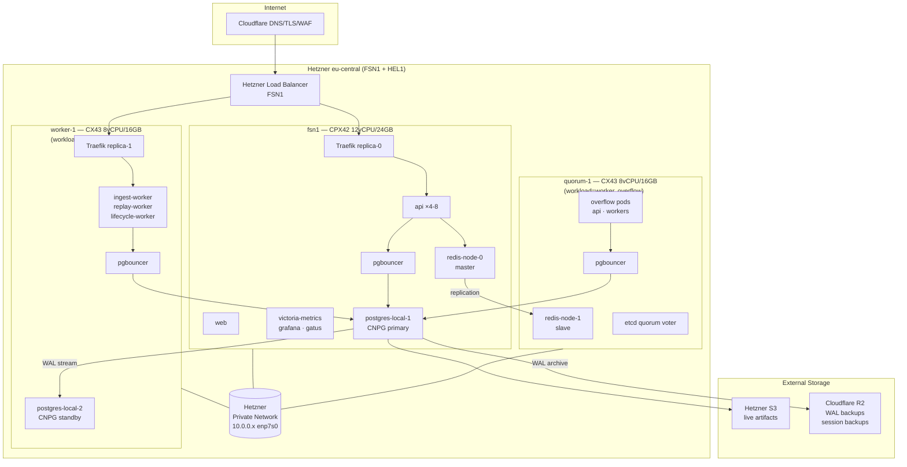

# All Things Cloud

Last updated: 2026-04-25

This is the operator-facing map of production: network path, deploy flow, storage layout, monitoring, backups, and the runtime services we actually have today.

## Tailscale, public traffic, and admin access

**Public path:** Internet -> **Cloudflare** (DNS / TLS / WAF) -> **Hetzner Load Balancer** (PROXY protocol) -> **Traefik** on k3s -> `rejourney.co`, `api.rejourney.co`, `ingest.rejourney.co`

**Admin path:** Operators join the **Tailscale tailnet** and use **SSH**, **kubectl**, and **kubectl port-forward** over `100.x` addresses. Admin UIs are not public anymore.

**Important boundary:** Tailscale protects operator access to the node and cluster. It is not in the normal in-cluster service path. Internal traffic such as `Grafana -> VictoriaMetrics` or `postgres-exporter -> postgres-app-rw` stays on Kubernetes service networking.


Related docs:

- [admin-tools-private-access.md](./admin-tools-private-access.md)
- [rejourney-ci.md](./rejourney-ci.md)
- [legacy.md](./legacy.md)
- [postgres-backup-and-restore.md](./postgres-backup-and-restore.md)
- sibling repo `rejourney-internal/dev_docs/`

## Architecture



## Deployment

```text
┌──────────────┐      ┌─────────────────────────────┐      ┌─────────────────┐
│  GitHub Repo │─────▶│      GitHub Actions         │─────▶│      GHCR       │
│ (rejourney)  │      │  scripts/k8s/deploy-release │      │ (Docker Images) │
└──────────────┘      └──────────────┬──────────────┘      └────────┬────────┘
                                     │                              │
                                     │ render + kubectl apply       │ pull
                                     ▼                              ▼
                      ┌────────────────────────────────────────────────────┐
                      │   3-node HA k3s cluster (fsn1 + worker-1 + quorum-1) │
                      │                namespace: rejourney                │
                      └────────────────────────────────────────────────────┘
```

`deploy-release.sh` does all of the following now:

- renders `k8s/*.yaml` into a temp dir with image-tag substitution
- applies `namespace.yaml`, `traefik-config.yaml`, `exporters.yaml`, `ingress.yaml`, and `storage-class-db-local.yaml` up front
- applies `k8s/cnpg/postgres-cnpg.yaml` explicitly in its own CNPG step
- server-side applies `k8s/grafana-dashboards.yaml` because the ConfigMap is too large for client-side apply annotations
- bulk-applies the rendered root manifests with `--prune -l app.kubernetes.io/part-of=rejourney`
- restores and de-labels the Helm-managed `redis` Service if prune touched it
- waits for `cadvisor` and `node-exporter` DaemonSets as well as the normal Deployments
- removes legacy imported Grafana dashboards after the rollout

`k8s/cnpg-backups.yaml` is a normal root-level manifest, so it is applied in the bulk pass. The live CNPG `Cluster` CR itself is still handled separately.

## K3s Details

The cluster is a fully HA 3-node k3s setup with embedded etcd. All three nodes are k3s server nodes (control plane participants). Flannel VXLAN is bound to the Hetzner private network interface `enp7s0` (`10.0.0.x`) on all nodes — not `eth0`. The Hetzner private network spans FSN1 and HEL1 in the `eu-central` zone.

| Node | Hostname | Location | Type | Specs | Role |
|------|----------|----------|------|-------|------|
| fsn1 (main) | ubuntu-4gb-fsn1-1 | FSN1 | CPX42 | 12 vCPU, 24 GB RAM | Control plane + Postgres primary + Redis master + pgbouncer + API + web + monitoring |
| worker-1 | rejourney-worker-1 | HEL1 | CX43 | 8 vCPU, 16 GB RAM | Control plane + preferred worker node (ingest/replay/lifecycle workers) + CNPG standby + pgbouncer |
| quorum-1 | rejourney-quorum-1 | HEL1 | CX43 | 8 vCPU, 16 GB RAM | Control plane + etcd quorum + overflow worker (labeled `workload=worker`, untainted) + Redis replica + pgbouncer |

**Total cluster cost: ~$71/mo** (CPX42 $43 + CX43×2 at $13.99 each)

### Pod placement strategy

- API, web, ingest-upload, and session-lifecycle-worker have no hard `nodeSelector`. They use soft affinity preferring fsn1 for lower latency to the current Postgres and Redis primaries, then reschedule onto HEL1 nodes if fsn1 is unavailable.
- Ingest-worker and replay-worker use soft `nodeAffinity` preferring `workload=worker` — both worker-1 and quorum-1 carry this label, so workers land on either and fall back to fsn1 if both are unavailable.
- API/web use preferred `podAntiAffinity` to spread replicas across nodes.
- Traefik runs 2 replicas with required `podAntiAffinity`, excluding quorum-1 — one replica on fsn1, one on worker-1. quorum-1 is excluded from the Hetzner LB via `node.kubernetes.io/exclude-from-external-load-balancers=true`.
- A **Descheduler** CronJob runs every 5 minutes with `LowNodeUtilization` policy, evicting pods from nodes above 70% CPU requests and rescheduling them onto nodes below 30%.

### Scale-out latency note

Adding HEL1 nodes increases capacity and failure tolerance, but it does not move the writable data plane away from fsn1. Postgres primary and Redis master are normally on fsn1, so pods scheduled in HEL1 pay a cross-location hop for database/cache work. During the April 2026 scale-out, HPA also allowed more worker/API concurrency against the same single Postgres primary, which made the app slower even though there were more servers.

The current mitigation is HA-safe:

- PgBouncer has one replica per node and its Service uses `internalTrafficPolicy: Local`, so a pod talks to its node-local PgBouncer when that node has one instead of randomly crossing nodes before going to Postgres.
- Hot user-facing services prefer fsn1 with soft affinity only, reducing normal-case latency without preventing failover onto HEL1.
- HPA max replicas are capped lower than the first scale-out attempt so backlog drains do not overwhelm Postgres.

The monitoring stack also uses small local-path PVCs for `grafana-data`, `gatus-data`, and `victoria-metrics-data`.

## Ingest Pathway

```text
┌─────────────┐   presign / complete / relay    ┌─────────────────────────────────────┐
│ JS / native │ ───────────────────────────────▶│ API (+ ingest routes)               │
│ SDK         │                                 │ sessions · recording_artifacts ·    │
└─────────────┘                                 │ metrics · ingest_jobs               │
       │                                        └───────────────┬─────────────────────┘
       │                                                        │
       │  PUT uploads (relay)                                   │ enqueue + state
       ▼                                                        ▼
┌─────────────┐   object payloads                      ┌────────────────┐
│ Hetzner S3  │ ◀───────────────────────────────────── │ PgBouncer ->   │
│ (artifacts) │                                        │ postgres-app-rw│
└──────┬──────┘                                        │ -> postgres-local
       │                                               │ (source of truth)
       │                                               └───────┬────────┘
       │                                                       │
       │                                                       │ job rows / locks
       ▼                                                       ▼
┌──────────────────────────────────────────────────────────────────────────────┐
│ Redis - cache, idempotency, ingest job coordination, worker-side limits     │
└───────────────────────────────┬──────────────────────────────────────────────┘
                                │
        ┌───────────────────────┼───────────────────────┐
        ▼                       ▼                       ▼
┌───────────────┐     ┌─────────────────┐     ┌──────────────────────────┐
│ ingest-worker │     │ replay-worker   │     │ session-lifecycle-worker │
│ drain jobs:   │     │ drain jobs:     │     │ sweeps + session         │
│ events,       │     │ screenshots,    │     │ reconciliation           │
│ crashes, ANRs │     │ hierarchy       │     │                          │
└───────┬───────┘     └────────┬────────┘     └────────────┬─────────────┘
        │                      │                           │
        └──────────────────────┴───────────────────────────┘
                               │
                               ▼
                    updates artifacts, sessions, replay readiness,
                    lifecycle flags (still Postgres + S3 as above)
```

## Monitoring Runtime Path

- **Grafana** reads from **VictoriaMetrics** over internal Kubernetes DNS. Dashboards are generated from `scripts/k8s/gen-grafana-dashboards.py` into `k8s/grafana-dashboards.yaml` and auto-provisioned under the `Rejourney` folder. Imported Grafana.com dashboards are intentionally temporary and are deleted on deploy.
- **Node exporter** is part of the first-party dashboard set now:
  - `10 — Kubernetes` is the main node CPU / memory / disk view
  - `70 — VictoriaMetrics & Self` shows target health by scrape job
  - `00 — Overview` includes a direct node-exporter up/down stat
- **PVC charts** intentionally show only the live claims we actually use now:
  - `postgres-local-*`
  - `redis-data-redis-node-*`
  - `grafana-data`
  - `gatus-data`
  - `victoria-metrics-data`
  Legacy orphan PVCs are excluded from the Grafana queries on purpose so they do not pollute storage panels. Actual local-path usage now comes from the node-exporter textfile collector sidecar (`rejourney_local_pvc_*`) because kubelet does not reliably emit `kubelet_volume_stats_*` for the Postgres and Redis PVCs on this storage path and returns misleading root-filesystem-sized values for the remaining local-path claims.
- **VictoriaMetrics** scrapes `node-exporter`, `cadvisor`, `kube-state-metrics`, `postgres-exporter`, `pushgateway`, Traefik metrics, Redis exporter metrics, CNPG pod metrics discovered via `cnpg.io/cluster=postgres-local`, and kubelet metrics for general node state. Local-path PVC sizing panels use `rejourney_local_pvc_*` plus PVC requested size from `kube-state-metrics`.
- **Gatus** should prefer internal service URLs for app-health checks because Cloudflare can challenge public HTTP probes even while the app is healthy. Its PostgreSQL TCP check targets `postgres-app-rw.rejourney.svc.cluster.local:5432`.
- **postgres-exporter** connects to `postgres-app-rw` using the `monitoring` role with `sslmode=disable`.
- **cAdvisor** is the source of truth for live pod/container CPU and memory. If Grafana shows object state but blank resource charts, check `cadvisor`, not `kube-state-metrics`.

## Session Backup Deployment Notes

- The session backup CronJob is deployed from [archive.yaml](../k8s/archive.yaml).
- Production currently schedules that CronJob hourly so queued backupable sessions do not wait for a once-daily drain.
- Production also runs a `session-backup-seed` CronJob every 5 minutes to enqueue old eligible sessions that were not already inserted from the finalize path.
- The source-of-truth script for that job is [session-backup.mjs](../scripts/k8s/session-backup.mjs), and GitHub Actions runs [check-archive-sync.sh](../scripts/k8s/check-archive-sync.sh) before `kubectl apply`.
- A deploy from `main` updates the backup job logic, including legacy hierarchy gzip repair and archive-friendly screenshot repacking for R2.
- The committed `session-backup-seed` manifest should stay `suspend: false`; if prod is manually unsuspended but Git still says `true`, the next deploy will silently turn it off again.
- Detailed queue / backup / retention rules live in [session-backup-retention-internals.md](./session-backup-retention-internals.md).

## Data Plane (Current Production)

- **Postgres**
  - CloudNativePG `Cluster` name: `postgres-local`
  - Manifest: `k8s/cnpg/postgres-cnpg.yaml`
  - Runtime services: `postgres-app-rw`, `postgres-app-r`, `postgres-app-ro`
  - Application path: app services -> `PGBOUNCER_URL` -> `pgbouncer` -> `postgres-app-rw`
  - Backup model: continuous WAL archive to Cloudflare R2 (`s3://rejourney-backup/cnpg-wal`) plus daily CNPG `ScheduledBackup` `postgres-daily-backup` from `k8s/cnpg-backups.yaml` at `03:00:00 UTC`
  - Retention policy in the cluster spec is `30d`
  - The `bootstrap.pg_basebackup` and `externalClusters` blocks remain in the manifest only because the live cluster was created during the storage cutover from an earlier source. They are not part of the normal application traffic path.
  - **2 instances**: primary (`postgres-local-1`) on fsn1, standby (`postgres-local-2`) on worker-1
  - Required `podAntiAffinity` — primary and standby are always on different nodes
  - Auto-promotes standby to primary on primary failure (~30s)
  - WAL streaming from primary to standby continuously; WAL archive to Cloudflare R2
  - CPU: request 500m, limit 5000m; Memory: 6Gi request, 10Gi limit
  - Storage: `rejourney-db-local-retain`, 100Gi per instance
- **PgBouncer**
  - Image: `edoburu/pgbouncer:v1.25.1-p0`
  - **3 replicas** with required `podAntiAffinity` — one on each node (fsn1, worker-1, quorum-1)
  - Transaction pooling
  - `DEFAULT_POOL_SIZE=12`
  - `MAX_CLIENT_CONN=800`
  - Upstream target: `postgres-app-rw:5432`
  - Service uses `internalTrafficPolicy: Local`; apps normally connect to the PgBouncer replica on their own node. If a node has no local ready PgBouncer endpoint, Kubernetes will not silently route that Service call to another node, so keep the DaemonSet-like 3-replica placement healthy.
  - Connection budget rule: keep `(pgbouncer replicas * DEFAULT_POOL_SIZE)` below Postgres usable slots (`max_connections - superuser_reserved_connections`) with headroom for admin and monitoring sessions.
- **Redis**
  - Bitnami Helm chart with Sentinel
  - Config source: `k8s/helm/redis-values.yaml`
  - `replicaCount: 2`, `sentinel.quorum: 1`
  - `redis-node-0` (master) on fsn1, `redis-node-1` (slave) on quorum-1
  - Preferred `podAntiAffinity` — nodes spread but not hard-pinned
  - On master failure, 1 surviving sentinel can elect a new master (~10s)
  - Storage class: `rejourney-db-local-retain`, 8Gi PVC per node
  - `maxmemory: 900mb`, `maxmemory-policy: allkeys-lru`, AOF persistence enabled
  - Modules: RediSearch + ReJSON
  - Metrics come from the Bitnami redis-exporter sidecar on `redis-metrics:9121`
  - Applications should use Sentinel discovery (`REDIS_SENTINEL_HOST=redis.rejourney.svc.cluster.local`) to find the current master. The generic `redis:6379` Service can include both master and replica endpoints in this Bitnami Sentinel topology, so it is not a safe direct-write endpoint except as a legacy fallback.
- **Live object storage**
  - Hetzner S3 stores live session artifacts
  - Cloudflare R2 stores session backups plus CNPG WAL/base backups
  - Credentials split between `s3-secret` and `r2-backup-secret`
- **Monitoring PVCs**
  - `grafana-data`
  - `gatus-data`
  - `victoria-metrics-data`

## Current Production Runtime Notes

- Long-running Deployments:
  - `api`
  - `web`
  - `pgbouncer`
  - `ingest-worker`
  - `replay-worker`
  - `session-lifecycle-worker`
  - `alert-worker`
  - `victoria-metrics`
  - `grafana`
  - `gatus`
  - `pushgateway`
  - `kube-state-metrics`
  - `postgres-exporter`
- DaemonSets:
  - `cadvisor`
  - `node-exporter`
- Kubernetes CronJobs:
  - `session-backup`
  - `session-backup-seed`
  - `retention-worker`
  - `descheduler` (every 5 minutes, `LowNodeUtilization` — evicts pods from nodes >70% CPU requests onto nodes <30%)
- CNPG scheduled backups:
  - `ScheduledBackup/postgres-daily-backup`
  - resulting `Backup` CRs in the `rejourney` namespace
- There is no separate billing worker anymore. Billing is handled by Stripe webhooks through the API.

## HPA (Autoscaling)

| Deployment | Min | Max | CPU Target |
|------------|-----|-----|------------|
| `api` | 4 | 8 | 65% |
| `ingest-upload` | 2 | 4 | 70% |
| `ingest-worker` | 3 | 6 | 60% |
| `replay-worker` | 2 | 6 | 60% |

## PodDisruptionBudgets

| Workload | Min Available |
|----------|--------------|
| `api` | 3 |
| `web` | 1 |
| `pgbouncer` | 1 |
| `ingest-upload` | 1 |
| `ingest-worker` | 1 |
| `replay-worker` | 1 |

## Failure Modes

| Component | fsn1 dies | worker-1 dies | quorum-1 dies |
|-----------|-----------|---------------|---------------|
| k3s API | Alive (2/3 etcd quorum: worker-1 + quorum-1) | Alive (fsn1 + quorum-1) | Alive (fsn1 + worker-1) |
| Traefik | worker-1 serves; LB routes around fsn1 | fsn1 serves; LB routes around worker-1 | Unaffected (not in LB) |
| Postgres | CNPG promotes standby on worker-1 (~30s) | Standby gone; primary on fsn1 intact | Unaffected |
| Redis | Sentinel on quorum-1 promotes redis-node-1 to master (~10s) | redis-node-0 (master on fsn1) intact | redis-node-0 (master) loses its slave; Sentinel on fsn1 remains |
| pgbouncer | worker-1 + quorum-1 instances serve | fsn1 + quorum-1 instances serve | fsn1 + worker-1 instances serve |
| Workers | Reschedule to worker-1/quorum-1 (soft affinity) | Reschedule to fsn1/quorum-1 | Reschedule to fsn1/worker-1 |
| API/web | Reschedule to worker-1/quorum-1 | Reschedule to fsn1/quorum-1 | Reschedule to fsn1/worker-1 |
| Data | Safe — WAL to R2; standby had all writes | Safe — primary intact | Safe |

## Retention + Backup Coordination

- Production retention runs every 15 minutes with `concurrencyPolicy: Forbid`.
- The container entrypoint is `node dist/worker/retentionWorker.js --once --drain-backlog --trigger=scheduled`.
- Retention also takes a Postgres run lock in `retention_run_lock`, so a manual backfill and the CronJob cannot overlap.
- Retention only purges a session after backup safety checks pass:
  - normally that means a complete `session_backup_log` row exists
  - truly empty sessions are the intentional exception and may be purged outright
- This means retention is intentionally fail-safe on fresh deploys:
  - if `session_backup_log` does not exist yet, retention skips session purges
  - if a session has not been backed up yet, retention skips that session
- Backup is the source that creates and populates `session_backup_log`, so backup must run successfully before retention can start draining expired sessions.
- Some historical queue rows may now be parked as `status = 'source_missing'` instead of retrying forever. That is an operator safeguard for stale source-storage gaps, not a success path.
- Retention deletes only the session artifact payloads and cache state:
  - canonical S3 objects under `tenant/{teamId}/project/{projectId}/sessions/{sessionId}/...`
  - legacy disconnected objects under bare `sessions/...`
  - `recording_artifacts` rows
  - `ingest_jobs` rows
  - replay and cache state on the `sessions` row
- Retention keeps the `sessions` row and other analytics or fault data.
- Every purge attempt is logged to `retention_deletion_log`.

## Operational Commands

- Apply schema changes before enabling new retention behavior:
  - `cd backend && npm run db:migrate`
- Release deploy timeout tuning (for long-running `db-setup` migrations/bootstrap):
  - `DB_SETUP_TIMEOUT_SECONDS` defaults to `900` in `scripts/k8s/deploy-release.sh`
  - override per run if needed: `DB_SETUP_TIMEOUT_SECONDS=1200 bash scripts/k8s/deploy-release.sh <image-tag> <repository>`
- Manually drain the backlog once the backup job has populated `session_backup_log`:
  - `cd backend && npm run retention:backfill:expired-artifacts`
- Useful things to inspect during rollout:
  - `retention_deletion_log` for what was deleted or skipped
  - `retention_run_lock` for active retention runs
  - `session_backup_log` to confirm backup eligibility
  - Redis key `retentionWorker:last_summary` for the latest retention cycle summary
