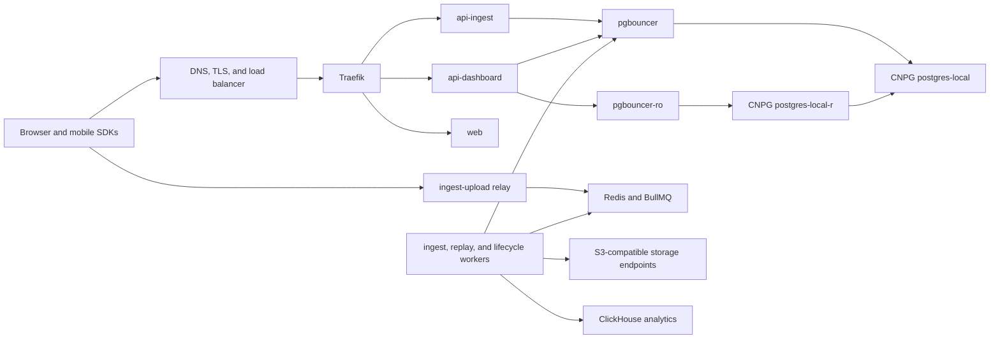

# Production Cloud Topology

Status: active manifest reference

Last verified against repository manifests: 2026-08-12

This document describes the production topology declared in `k8s/`. It is not
a live cluster inventory. Before an operational change, compare these manifests
with `kubectl get` output and the deployed release. Node sizes, replica counts
managed by HPAs, and temporary recovery state can differ from this reference.

Related runbooks:

- [Private admin access](admin-tools-private-access.md)
- [CI and deployment](rejourney-ci.md)
- [PostgreSQL backup and restore](postgres-backup-and-restore.md)
- [ClickHouse API analytics](clickhouse-api-endpoint-daily-stats-migration.md)

## Source of truth

| Area | Repository source |
| --- | --- |
| API, dashboard API, and upload relay | [`k8s/api.yaml`](../k8s/api.yaml) |
| Asynchronous and scheduled workers | [`k8s/workers.yaml`](../k8s/workers.yaml) |
| PostgreSQL cluster | [`k8s/cnpg/postgres-cnpg.yaml`](../k8s/cnpg/postgres-cnpg.yaml) |
| Database pools | [`k8s/pgbouncer.yaml`](../k8s/pgbouncer.yaml) |
| ClickHouse | [`k8s/clickhouse.yaml`](../k8s/clickhouse.yaml) |
| Ingress | [`k8s/ingress.yaml`](../k8s/ingress.yaml) |
| Release ordering | [`scripts/k8s/deploy-release.sh`](../scripts/k8s/deploy-release.sh) |

Generated dashboards and this document are explanatory. They do not override
the manifests or release script.

## Request and data paths


```mermaid
flowchart LR
  client[Browser and mobile SDKs] --> edge[DNS, TLS, and load balancer]
  edge --> ingress[Traefik]
  ingress --> ingest[api-ingest]
  ingress --> dashboard[api-dashboard]
  ingress --> web[web]
  client --> upload[ingest-upload relay]

  ingest --> rw[pgbouncer]
  dashboard --> rw
  dashboard --> readPool[pgbouncer-ro]
  upload --> redis[Redis and BullMQ]
  workers[ingest, replay, and lifecycle workers] --> redis
  workers --> rw
  workers --> storage[S3-compatible storage endpoints]
  rw --> postgres[CNPG postgres-local]
  readPool --> activeReads[CNPG postgres-local-r]
  activeReads --> postgres
  workers --> clickhouse[ClickHouse analytics]
```

`api-ingest` handles SDK-facing ingest/config traffic and is colocated with the
current CNPG primary by affinity and release reconciliation. `api-dashboard`
handles the remaining API surface. `ingest-upload` acknowledges small artifact
uploads through the Redis-backed flush path so provider latency is outside the
SDK request path.

`pgbouncer` always targets the writable `postgres-app-rw` service.
`pgbouncer-ro` targets `postgres-local-r`, which includes active CNPG instances
and therefore continues to reach the primary when no replica is available. Do
not change it back to the strict `postgres-local-ro` service without accepting
that reads will have no endpoint during single-instance operation or replica
recovery.

## Workloads

The production worker manifest currently declares:

| Kind | Workloads |
| --- | --- |
| Deployments | `ingest-worker`, `replay-worker`, `session-lifecycle-worker`, `alert-worker`, `revenue-sync-worker`, `google-ads-conversion-worker` |
| CronJobs | `retention-worker`, `research-lake-worker`, `research-lake-v2-worker`, `research-lake-compactor`, `research-lake-v2-compactor`, `stripe-sync-worker` |

The three artifact/lifecycle workers consume BullMQ queues. Scheduled retention,
research-lake, compaction, and synchronization work must not be moved into the
synchronous SDK ingest path.

ClickHouse is an analytics projection. API endpoint facts are written during
asynchronous artifact processing, and dashboard aggregates read rollups. A
ClickHouse outage is an analytics outage, not a reason to stop recording ingest.

## PostgreSQL: current temporary mode

The checked-in CNPG manifest intentionally declares:

- `instances: 1`
- `minSyncReplicas: 0`
- `maxSyncReplicas: 0`
- `synchronous_commit: remote_write`
- a `100Gi` retained local-path volume
- a `7d` CNPG object-store backup retention policy

The manifest comments say this is temporary until the HEL1 worker has enough
disk for a second instance. There is currently no CNPG standby to auto-promote
and no synchronous replica protecting an acknowledged write. Do not describe
the current deployment as primary-plus-standby HA.

When capacity is restored, the intended two-instance settings are
`instances: 2`, `minSyncReplicas: 1`, and `maxSyncReplicas: 1`. Changing those
values is an operational rollout, not a documentation-only correction: verify
node storage, local PV affinity, replication catch-up, connection capacity, and
backup health first.

For current recovery procedures, use
[PostgreSQL backup and restore](postgres-backup-and-restore.md).

## Placement model

The manifests use the `rejourney.co/datacenter=fsn1|hel1` node label:

- ingress, `api-ingest`, the current CNPG primary, and monitoring prefer FSN1;
- `api-dashboard`, ingest/replay batch workers, and several background workers
  prefer HEL1;
- `session-lifecycle-worker` prefers FSN1 because reconciliation and rollup work
  is database-heavy;
- ClickHouse data replicas prefer HEL1 when ClickHouse is deployed;
- PgBouncer instances are spread across nodes and use `PreferClose` service
  routing.

Preferences are not proof of current placement. Always inspect pod nodes before
diagnosing cross-datacenter latency:

```bash
kubectl get nodes -L rejourney.co/datacenter
kubectl get pods -n rejourney -o wide
kubectl get pod -n rejourney \
  -l cnpg.io/cluster=postgres-local,cnpg.io/instanceRole=primary -o wide
```

## Storage and backup boundaries

Recording artifacts use project/global rows in `storage_endpoints`; each
artifact is pinned to the endpoint selected for it. Shadow endpoints provide
asynchronous redundant writes but are not the removed session-archive subsystem
and are not a retention gate. See [Storage and endpoints](storage-and-endpoints.md).

Database recovery uses CNPG base backups and WAL in object storage. ClickHouse
has its own backup CronJob and retention. Neither backup mechanism replaces
application-level retention policy or a tested restore drill.

## Failure and recovery expectations

| Failure | Expected behavior |
| --- | --- |
| API or worker pod | Kubernetes reschedules it; BullMQ retries stalled jobs according to worker policy. |
| Redis master | Sentinel elects a remaining Redis node; verify buffered artifact keys and queues after recovery. |
| ClickHouse node | API endpoint analytics may be stale or unavailable; SDK ingest must continue. |
| CNPG primary pod, node, or volume | The current single-instance manifest has no standby to promote. Recover the retained local volume when safe or restore a new cluster from CNPG backups. |
| FSN1 ingress path | Traffic is degraded until ingress and colocated services reschedule or the edge/load-balancer path is restored. |
| Monitoring node | Monitoring visibility may be lost while customer-facing services continue; use cluster-native checks during the gap. |

Do not claim zero Postgres data loss in the current single-instance mode. The
recovery point is bounded by the health and freshness of the retained volume,
WAL archive, and base-backup catalog.

## Deployment model

GitHub Actions builds release images and invokes
`scripts/k8s/deploy-release.sh` on the deployment host. The release script
controls manifest rendering, CNPG and PgBouncer ordering, database setup,
optional ClickHouse setup/backfill, bulk apply/prune, rollout waits, and
post-deploy reconciliation. See [CI and deployment](rejourney-ci.md) for the
step-by-step path.

ClickHouse creation is separately gated for fresh/recovery environments. App
secret references are optional so the transactional stack can deploy before
ClickHouse, but a production environment that enables ClickHouse reads must
have fresh rollups before the dashboard can show API endpoint analytics.

## Pre-change verification

Run read-only checks before relying on this topology:

```bash
kubectl config current-context
kubectl get cluster postgres-local -n rejourney
kubectl get pods,deployments,cronjobs -n rejourney -o wide
kubectl get endpoints -n rejourney postgres-app-rw postgres-local-r pgbouncer pgbouncer-ro
kubectl get backup,scheduledbackup -n rejourney
```

For ClickHouse-enabled environments, also verify its custom resources, pods,
Keeper quorum, newest raw fact, and newest rollup date. For storage changes,
inspect the database-backed endpoint configuration with the supported endpoint
management script rather than assuming environment variables are authoritative.

## Invariants

- Keep SDK ingest colocated with and independent from analytical stores.
- Keep Postgres as the transactional source of truth.
- Keep Redis on `noeviction` while BullMQ owns job state.
- Keep object-storage credentials out of manifests and documentation.
- Treat current CNPG replica count as a manifest fact, not a desired-state
  assumption.
- Verify live topology before every production mutation.
