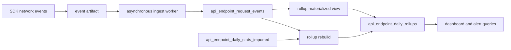

# ClickHouse API Endpoint Analytics

Status: active architecture and operator runbook

Last verified against the repository: 2026-08-12

ClickHouse is the runtime analytics store for API endpoint telemetry. Postgres
remains the source of truth for sessions, artifacts, projects, auth, billing,
and lifecycle state. The migration history that led to this design remains in
Git; this document describes only the current system.

## Source of truth

- Schemas: [`backend/clickhouse`](../backend/clickhouse)
- Schema runner: [`backend/scripts/setupClickHouse.ts`](../backend/scripts/setupClickHouse.ts)
- Raw API fact sink: [`backend/src/services/clickhouseApiStatsSink.ts`](../backend/src/services/clickhouseApiStatsSink.ts)
- Dashboard queries: [`backend/src/services/apiEndpointStatsClickHouse.ts`](../backend/src/services/apiEndpointStatsClickHouse.ts)
- Rollup rebuild: [`backend/scripts/backfillClickHouseApiEndpointRollups.ts`](../backend/scripts/backfillClickHouseApiEndpointRollups.ts)
- Local manifests: [`local-k8s/clickhouse.yaml`](../local-k8s/clickhouse.yaml) and
  [`local-k8s/clickhouse-backfill-api-rollups.yaml`](../local-k8s/clickhouse-backfill-api-rollups.yaml)
- Production manifests: [`k8s/clickhouse.yaml`](../k8s/clickhouse.yaml),
  [`k8s/clickhouse-setup.yaml`](../k8s/clickhouse-setup.yaml), and
  [`k8s/clickhouse-backfill-api-rollups.yaml`](../k8s/clickhouse-backfill-api-rollups.yaml)

## Data flow



The asynchronous artifact processor normalizes application endpoint paths and
writes request facts to `api_endpoint_request_events`. Rejourney's own ingest
paths and static assets are excluded from product endpoint analytics. The sink
uses an artifact-scoped deduplication token and logs failures without turning a
ClickHouse outage into an SDK ingest outage.

`api_endpoint_daily_rollups` is the runtime read model. Dashboard and alert
queries must not scan imported history or raw facts for their normal aggregate
views. `api_endpoint_daily_stats_imported` exists only to preserve pre-cutover
aggregate history during a rebuild.

The old Postgres `api_endpoint_daily_stats` object is not a runtime fallback.
A temporary empty compatibility shell may exist for rolling-deploy safety; do
not add new reads or writes to it.

## Feature flags

The backend uses three independent controls:

| Variable | Purpose |
| --- | --- |
| `CLICKHOUSE_ENABLED` | Configure the client when a URL is present |
| `CLICKHOUSE_DUAL_WRITE_ENABLED` | Allow asynchronous fact sinks to write |
| `CLICKHOUSE_READS_ENABLED` | Allow analytics queries to read ClickHouse |

Connection settings are `CLICKHOUSE_URL`, `CLICKHOUSE_USER`,
`CLICKHOUSE_PASSWORD`, `CLICKHOUSE_DATABASE`, and
`CLICKHOUSE_REQUEST_TIMEOUT_MS`. Local defaults enable the full path. Fresh or
recovery production deployments remain explicitly gated in
[`scripts/k8s/deploy-release.sh`](../scripts/k8s/deploy-release.sh).

Do not make `/api/ingest/*` wait synchronously for ClickHouse. When ClickHouse
is unavailable, recording ingestion must continue; analytics may be delayed or
temporarily empty.

## Schema setup

Local setup is part of the local Kubernetes bootstrap:

```bash
npm run ci:local
```

To apply the schema from an environment that already has ClickHouse variables:

```bash
npm --prefix backend run clickhouse:setup
```

The setup runner records applied SQL files in `rejourney.schema_migrations`.
Add schema changes as new numbered files in `backend/clickhouse`; do not edit an
already-applied migration to change a live schema.

## Rebuilding API rollups

The supported backend command is:

```bash
npm --prefix backend run clickhouse:backfill:api-rollups -- --dry-run
```

Useful scopes:

```bash
# Rebuild a bounded date window. --until is exclusive.
npm --prefix backend run clickhouse:backfill:api-rollups -- \
  --since=2026-08-01 --until=2026-08-08

# Rebuild one project without truncating the shared table.
npm --prefix backend run clickhouse:backfill:api-rollups -- \
  --project-id=00000000-0000-0000-0000-000000000000

# Replace the entire rollup table from imported history plus raw facts.
npm --prefix backend run clickhouse:backfill:api-rollups -- --replace
```

`--replace` truncates the entire rollup table and cannot be combined with
`--since`, `--until`, or `--project-id`. Treat it as a maintenance operation:
confirm current backups, announce the analytics impact, and verify row dates and
totals after completion.

For Kubernetes, the equivalent manual jobs are
`clickhouse-backfill-api-rollups.yaml` in `local-k8s/` and `k8s/`. Production
deploys can run the rebuild with
`DEPLOY_CLICKHOUSE=true RUN_CLICKHOUSE_ROLLUP_BACKFILL=true`; normal releases do
not rebuild all rollups.

## Verification

Start with connectivity and table presence:

```bash
curl -fsS http://127.0.0.1:30123/ping

curl -fsS 'http://127.0.0.1:30123/?database=rejourney&query=SHOW%20TABLES'
```

For authenticated or non-local installations, use the configured ClickHouse
client or Kubernetes secret rather than putting credentials in shell history.

Check freshness and coverage with read-only queries:

```sql
SELECT max(inserted_at), count()
FROM rejourney.api_endpoint_request_events;

SELECT min(date), max(date), count()
FROM rejourney.api_endpoint_daily_rollups;

SELECT
  date,
  sum(total_calls) AS calls,
  sum(total_errors) AS errors,
  sum(sum_latency_ms) AS latency_ms
FROM rejourney.api_endpoint_daily_rollups
WHERE date >= today() - 7
GROUP BY date
ORDER BY date;
```

Then verify the dashboard API endpoint view for a known project and date range.
An empty rollup table produces empty analytics because there is no Postgres
runtime fallback.

Repository checks:

```bash
npm --prefix backend test -- apiEndpointStatsClickHouse
npm --prefix backend run build
```

## Failure handling

- Raw facts are stale but ingest is healthy: inspect asynchronous worker logs,
  `CLICKHOUSE_DUAL_WRITE_ENABLED`, connection settings, and ClickHouse health.
- Raw facts are fresh but rollups are stale: inspect the materialized view and
  run a bounded rebuild before considering `--replace`.
- Dashboard analytics are empty: confirm `CLICKHOUSE_READS_ENABLED`, rollup
  coverage for the requested project/date, and endpoint exclusion rules.
- Totals increase after repeated rebuilds: check whether a non-replacing rebuild
  was run over data already present in the summing table. Use a controlled full
  replacement when duplicate aggregate contributions must be removed.
- ClickHouse is down: restore analytics service independently; do not route API
  endpoint analytics back to the removed Postgres table or block ingest.

## Invariants

- Postgres owns transactional and lifecycle state; ClickHouse owns this
  analytics projection.
- API endpoint facts are written outside the synchronous ingest response path.
- Runtime aggregate reads use `api_endpoint_daily_rollups`.
- Endpoint normalization and exclusion rules stay consistent between live
  writes, rebuilds, and reads.
- Rebuilds are explicit, scoped when possible, and verified after completion.
- New schema changes are additive numbered migrations with tests.
