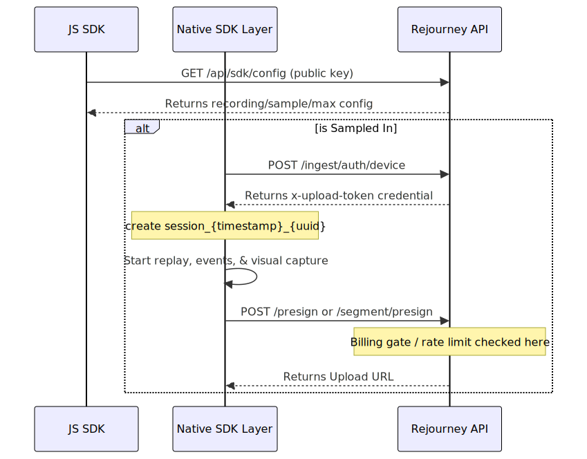

# Ingest + Session Recording Lifecycle (Visual)

Last updated: 2026-04-23

This doc is the ingest/runtime view: package start, upload lanes, relay, workers, Redis, and Postgres session state.

Deploy topology (which process runs where) lives in [All things cloud](/Users/mora/Desktop/Dev-mac/rejourney/dev_docs/allthingscloud.md). Deploy, `db-setup`, GitHub Actions, and local parity are in [Rejourney CI + Deploy Path](/Users/mora/Desktop/Dev-mac/rejourney/dev_docs/rejourney-ci.md).

Shortest correct mental model:

- The package usually creates a client-side `session_{timestamp}_{uuid}` ID and uploads under that ID.
- The first successful presign materializes the session row and counts billing once.
- Postgres is the source of truth for session lifecycle, artifact lifecycle, metrics, jobs, and usage.
- Redis is only the helper plane for cache, idempotency, and rate/limit coordination.
- Replay becomes visible when at least one screenshot artifact reaches `ready`.
- `/api/ingest/session/end` is a strong hint, but the backend must still work if the SDK never calls it.
- The backend decides "live vs closed" from `ended_at`, `last_ingest_activity_at`, pending replay work, and newer-session rollover; not from a single client callback.
- A session stops presenting as live ingest after 60 seconds without ingest touches, or immediately once `ended_at` is set.
- Late uploads may still arrive after close. They can finish artifact processing, but they must not clear `ended_at`, must not clear `duration_seconds`, and must not make the old row look live again.
- Hard ingest stops are intentionally narrow: `failed`, `deleted`, `recording_deleted`, or `is_replay_expired`.

## Flow Index



## [I1] Package Start / Rollover

```text
┌──────────────┐      GET /api/sdk/config       ┌─────────────────────────────┐
│ JS SDK       │───────────────────────────────▶│ SDK config route            │
│ public key   │◀───────────────────────────────│ recording/sample/max config │
└──────┬───────┘                                │ Redis may cache sdk:config:*│
       │                                        └──────────────┬──────────────┘
       │ sampled in?                                          │
       ▼                                                      ▼
┌──────────────┐     POST /ingest/auth/device    ┌────────────────────────────┐
│ Native layer │───────────────────────────────▶│ device auth route          │
│ startSession │◀───────────────────────────────│ x-upload-token credential  │
└──────┬───────┘                                └──────────────┬─────────────┘
       │
       │ create session_{timestamp}_{uuid}
       │ start replay capture + event pipeline + visual capture
       ▼
┌──────────────────────────────────────────────────────────────────────────────┐
│ First /presign or /segment/presign starts uploading under that session ID   │
└──────────────────────────────────────────────────────────────────────────────┘
```

```text
┌──────────────────────────────────────────────────────────────────────────────┐
│ Package rollover / stop rules                                               │
│                                                                              │
│ Active -> background < 60s       : keep same session                        │
│ Active -> background >= 60s      : old session should close; next launch or │
│                                    resume may start a new session           │
│ Active -> user stop              : flush and close best-effort              │
│ Active -> duration limit reached : flush and close                          │
│ Process death / next launch      : backend may finalize old one later       │
└──────────────────────────────────────────────────────────────────────────────┘
```

```text
Background rollover threshold      60s
Rollover grace window               2s
Event heartbeat flush               5s
Max recording duration              backend-configured, clamped server-side
                                    to 1..10 minutes
```

### iOS: multitasking and force-quit (no guaranteed `/session/end`)

A common user path is: swipe up to the app switcher, then swipe the app away to force-quit it. On that path the OS has usually already delivered `UIApplication.didEnterBackgroundNotification`. The app becomes suspended; the later swipe kills the process with no reliable opportunity to run teardown code.

Why `/api/ingest/session/end` may be missing:

- After background, the native layer usually pauses and flushes best-effort; it does not treat every background as a guaranteed final close.
- `UIApplication.willTerminateNotification` is not guaranteed when the user force-quits from the switcher, especially after the app is already backgrounded or suspended.
- The client may therefore never emit a final end signal. The backend must be able to close the row from ingest inactivity and artifact evidence alone.

Expectations:

- This is normal iOS platform behavior, not a backend defect.
- The authoritative closure path is server-side reconciliation plus the 60-second inactivity rule. `/session/end` is helpful when present, not required.
- The same principle applies on Android: lifecycle callbacks differ across OEMs, so the backend must not depend on every kill path emitting `/session/end`.

Package-side rules that matter downstream:

- In the normal React Native flow, the session ID is generated on-device.
- There is still a backend fallback for `/api/ingest/presign` without a `sessionId`; it mints `session_{timestamp}_{randomHex}`.
- The timestamp embedded in the session ID is later used by the backend to infer `started_at`.
- JS fetches [`/api/sdk/config`](/Users/mora/Desktop/Dev-mac/rejourney/backend/src/routes/sdk.ts) before start and can disable replay before any visual upload happens.
- Native obtains the upload credential from [`/api/ingest/auth/device`](/Users/mora/Desktop/Dev-mac/rejourney/backend/src/routes/ingestDeviceAuth.ts) and sends it as `x-upload-token`.

Relevant package files:

- [`packages/react-native/src/index.ts`](/Users/mora/Desktop/Dev-mac/rejourney/packages/react-native/src/index.ts)
- [`packages/react-native/android/src/main/java/com/rejourney/recording/ReplayOrchestrator.kt`](/Users/mora/Desktop/Dev-mac/rejourney/packages/react-native/android/src/main/java/com/rejourney/recording/ReplayOrchestrator.kt)
- [`packages/react-native/android/src/main/java/com/rejourney/recording/TelemetryPipeline.kt`](/Users/mora/Desktop/Dev-mac/rejourney/packages/react-native/android/src/main/java/com/rejourney/recording/TelemetryPipeline.kt)
- [`packages/react-native/android/src/main/java/com/rejourney/engine/DeviceRegistrar.kt`](/Users/mora/Desktop/Dev-mac/rejourney/packages/react-native/android/src/main/java/com/rejourney/engine/DeviceRegistrar.kt)
- [`packages/react-native/ios/Engine/RejourneyImpl.swift`](/Users/mora/Desktop/Dev-mac/rejourney/packages/react-native/ios/Engine/RejourneyImpl.swift)

## [I2] Upload Lanes / Session Creation

```text
                          same sessionId
                                │
          ┌─────────────────────┴─────────────────────┐
          ▼                                           ▼
┌─────────────────────────┐                 ┌──────────────────────────┐
│ Events lane             │                 │ Replay lane              │
│ POST /presign           │                 │ POST /segment/presign    │
│ PUT relay upload        │                 │ PUT relay upload         │
│ POST /batch/complete    │                 │ POST /segment/complete   │
└─────────────┬───────────┘                 └──────────────┬───────────┘
              └─────────────────────┬──────────────────────┘
                                    ▼
                    sessions + recording_artifacts + metrics
```

```text
┌──────────────────────────────────────────────────────────────────────────────┐
│ Presign request path                                                        │
│                                                                              │
│ 1. Billing gate / project recording rules                                   │
│ 2. Session-limit check                                                      │
│ 3. ensureIngestSession(projectId, sessionId)                                │
│ 4. If created == true -> increment project_usage.sessions exactly once      │
│ 5. register pending artifact row                                            │
│ 6. return upload relay URL                                                  │
└──────────────────────────────────────────────────────────────────────────────┘
```

Session-creation rules:

- New sessions are inserted with `status='processing'` and a matching `session_metrics` row.
- Billing/session counting happens only when the session row is first created.
- Replay screenshot uploads are rejected if the project disables recording or the session is sampled out.
- The backend does not depend on `/session/end` to create or close sessions.
- `ready` is not a hard-ingest terminal state. The backend may still accept later artifact work for the same session, but closed timing stays sticky once `ended_at` and `duration_seconds` are stored.
- True hard stops are enforced only for `failed`, `deleted`, retention-purged recordings, or replay-expired recordings.

Relevant routes:

- [`backend/src/routes/ingestUploads.ts`](/Users/mora/Desktop/Dev-mac/rejourney/backend/src/routes/ingestUploads.ts)
- [`backend/src/routes/ingestLifecycle.ts`](/Users/mora/Desktop/Dev-mac/rejourney/backend/src/routes/ingestLifecycle.ts)
- [`backend/src/routes/ingestUploadRelay.ts`](/Users/mora/Desktop/Dev-mac/rejourney/backend/src/routes/ingestUploadRelay.ts)
- [`backend/src/routes/ingestFaults.ts`](/Users/mora/Desktop/Dev-mac/rejourney/backend/src/routes/ingestFaults.ts)
- [`backend/src/services/ingestSessionLifecycle.ts`](/Users/mora/Desktop/Dev-mac/rejourney/backend/src/services/ingestSessionLifecycle.ts)
- [`backend/src/services/ingestArtifactLifecycle.ts`](/Users/mora/Desktop/Dev-mac/rejourney/backend/src/services/ingestArtifactLifecycle.ts)
- [`backend/src/services/sessionIngestImmutability.ts`](/Users/mora/Desktop/Dev-mac/rejourney/backend/src/services/sessionIngestImmutability.ts)

## [I3] Upload Relay / Artifact + lifecycle workers / Artifact states

```text
┌──────────┐   /presign or /segment/presign   ┌──────────────────────────────┐
│ Package  │─────────────────────────────────▶│ recording_artifacts          │
│ / SDK    │◀─────────────────────────────────│ status = pending             │
└────┬─────┘        relay URL returned        └──────────────┬───────────────┘
     │                                                      │
     │ PUT /upload/artifacts/:artifactId                    │
     ▼                                                      ▼
┌──────────────┐                                   ┌──────────────────────────┐
│ upload relay │──────────────────────────────────▶│ artifact = uploaded      │
└────┬─────────┘                                   │ ingest_jobs queued       │
     │                                             └─────────────┬────────────┘
     │ /batch/complete or /segment/complete                      │
     ▼                                                           ▼
┌──────────────┐                                   ┌──────────────────────────┐
│ ingest route │──────────────────────────────────▶│ same ingest_jobs table;  │
│ merge metrics│                                   │ workers claim by kind     │
└──────────────┘                                   └─────────────┬────────────┘
                                                                 ▼
              ┌──────────────────────────────────────────────────────────────────┐
              │ Artifact workers (two deployments; see workerDefinitions.ts)    │
              │  ┌──────────────────────────┐    ┌──────────────────────────────┐│
              │  │ ingest-artifact worker   │    │ replay-artifact worker       ││
              │  │ events, crashes, ANRs    │    │ screenshots, hierarchy       ││
              │  └────────────┬─────────────┘    └──────────────┬───────────────┘│
              └───────────────┴──────────────────────────────────┴────────────────┘
                                            │
                                            ▼
                              process / normalize (artifactJobProcessor)
                              artifact = ready / failed
                              reconcileSessionState()
```

```text
Artifact state machine

pending   -> uploaded -> ready
pending   -> abandoned
uploaded  -> failed
failed    -> uploaded    (recoverable retry path)
```

```text
┌──────────────────────────────────────────────────────────────────────────────┐
│ Session-lifecycle worker (sessionLifecycleWorker.ts)                        │
│ Poll ~500ms; session sweep interval 10s between runs of:                    │
│                                                                              │
│ Each sweep (at most every 10s):                                             │
│   reconcileDueSessions (batched)                                            │
│   abandon expired pending artifacts (> 10m)                                 │
│   requeue stale processing jobs (> 5m)                                      │
│   queueRecoverableArtifacts (uploaded but missing a usable job)             │
└──────────────────────────────────────────────────────────────────────────────┘
```

```text
┌──────────────────────────────────────────────────────────────────────────────┐
│ Artifact workers (startArtifactWorker.ts -> poll ~500ms per deployment)     │
│                                                                              │
│ Startup: recoverStuckArtifactJobs() -> stuck processing jobs to pending     │
│ Each tick: selectRunnableArtifactJobs (filtered by worker kind allowlist)   │
│            -> processArtifactJob -> reconcileSessionState() as needed       │
└──────────────────────────────────────────────────────────────────────────────┘
```

Important worker nuance:

- **ingest-artifact worker** ([`ingestArtifactWorker.ts`](/Users/mora/Desktop/Dev-mac/rejourney/backend/src/worker/ingestArtifactWorker.ts)) drains `events`, `crashes`, and `anrs`.
- **replay-artifact worker** ([`replayArtifactWorker.ts`](/Users/mora/Desktop/Dev-mac/rejourney/backend/src/worker/replayArtifactWorker.ts)) drains `screenshots` and `hierarchy`.
- **session-lifecycle worker** ([`sessionLifecycleWorker.ts`](/Users/mora/Desktop/Dev-mac/rejourney/backend/src/worker/sessionLifecycleWorker.ts)) runs periodic sweeps only; it does not process artifact bytes itself.
- `events` artifacts update session metadata, `session_metrics`, and downstream analytics side effects.
- `crashes` and `anrs` artifacts create issue rows and increment crash/ANR counters.
- `screenshots` and `hierarchy` mostly affect replay availability and final session presentation.
- The heavy full-table artifact lifecycle backfill is manual by default. Normal worker startup skips it unless `INGEST_ENABLE_STARTUP_BACKFILL=true`.
- Manual backfill command: `cd backend && npm run db:backfill:artifact-lifecycle`

Relevant files:

- [`backend/src/routes/ingestUploadRelay.ts`](/Users/mora/Desktop/Dev-mac/rejourney/backend/src/routes/ingestUploadRelay.ts)
- [`backend/src/worker/ingestArtifactWorker.ts`](/Users/mora/Desktop/Dev-mac/rejourney/backend/src/worker/ingestArtifactWorker.ts)
- [`backend/src/worker/replayArtifactWorker.ts`](/Users/mora/Desktop/Dev-mac/rejourney/backend/src/worker/replayArtifactWorker.ts)
- [`backend/src/worker/sessionLifecycleWorker.ts`](/Users/mora/Desktop/Dev-mac/rejourney/backend/src/worker/sessionLifecycleWorker.ts)
- [`backend/src/worker/workerDefinitions.ts`](/Users/mora/Desktop/Dev-mac/rejourney/backend/src/worker/workerDefinitions.ts)
- [`backend/src/worker/startArtifactWorker.ts`](/Users/mora/Desktop/Dev-mac/rejourney/backend/src/worker/startArtifactWorker.ts)
- [`backend/src/services/artifactJobProcessor.ts`](/Users/mora/Desktop/Dev-mac/rejourney/backend/src/services/artifactJobProcessor.ts)
- [`backend/src/services/ingestArtifactLifecycle.ts`](/Users/mora/Desktop/Dev-mac/rejourney/backend/src/services/ingestArtifactLifecycle.ts)

## [I4] Reconciliation / Auto-Finalizer / Close-Time Math

```text
┌──────────────────────────────────────────────────────────────────────────────┐
│ reconcileSessionState(sessionId)                                            │
│                                                                              │
│ readyScreenshotCount > 0 ?                                                  │
│   yes -> replay_available = true                                            │
│   no  -> replay_available = false                                           │
│                                                                              │
│ deriveSessionPresentationState():                                           │
│   - ended_at present => not live ingest                                     │
│   - newer visitor session => old row is not live ingest                     │
│   - last_ingest_activity_at older than 60s => not live ingest               │
│   - pending replay work blocks final ready state                            │
│                                                                              │
│ shouldFinalize?                                                             │
│   yes -> status = ready                                                     │
│          preserve stored ended_at/duration if already closed                │
│          otherwise derive authoritative close                               │
│   no  -> status = processing (unless hard terminal)                         │
└──────────────────────────────────────────────────────────────────────────────┘
```

```text
┌──────────────────────────────────────────────────────────────────────────────┐
│ Authoritative close resolution                                               │
│                                                                              │
│ 1. closeAnchorAtMs (best signal for background-time rollover)               │
│ 2. reported endedAt from /session/end                                       │
│ 3. latest replay artifact end_time                                          │
│ 4. last_ingest_activity_at                                                  │
│ 5. recording policy upper bound                                             │
│                                                                              │
│ then clamp:                                                                 │
│   started_at <= ended_at <= started_at + maxRecordingMinutes + 2 minutes    │
│   and cap to successor session start on the same visitor when applicable    │
│                                                                              │
│ duration_seconds = max(1, wall_clock_seconds - background_time_seconds)     │
└──────────────────────────────────────────────────────────────────────────────┘
```

```text
/api/ingest/session/end
  -> resolveLifecycleSession()
  -> merge session_metrics + sdk telemetry
  -> if sticky close already exists: return success without rewriting timing
  -> else resolveAuthoritativeSessionClose()
  -> markSessionIngestActivity(at = resolvedClose.endedAt, endedAt = resolvedClose.endedAt)
  -> reconcileSessionState()
```

Important reconciliation rules:

- Replay availability is artifact-driven, not `/session/end`-driven.
- `/session/end` is optional. The backend must still finalize a row after 60 seconds of ingest inactivity even if the SDK never sends an end event.
- The live-ingest window is 60 seconds. The lifecycle worker sweeps every 10 seconds.
- `ended_at` plus positive `duration_seconds` is sticky close timing. Once those are stored, later replay uploads must not clear them.
- Later `/session/end` calls for an already-closed row return success while preserving the stored close timing instead of recomputing a smaller duration.
- Late artifact uploads still update artifact rows and jobs, but on already-closed sessions they only touch activity; they do not reopen the session clock.
- A newer session for the same visitor suppresses the LIVE badge on the older row.
- Only pending replay work blocks final ready state. Non-replay ingest work may still complete after the session is already presented as `ready`.
- If `closeAnchorAtMs` ends the session earlier than the later reported `/session/end` time, the backend trims the post-close background tail before computing playable duration. This prevents an older session from collapsing when the app resumes long after backgrounding.

Canonical lifecycle fields in Postgres:

- `sessions.status`
- `sessions.started_at`
- `sessions.ended_at`
- `sessions.last_ingest_activity_at`
- `sessions.duration_seconds`
- `sessions.background_time_seconds`
- `sessions.replay_available`
- `sessions.replay_segment_count`
- `sessions.replay_storage_bytes`

Legacy compatibility fields may still exist physically in the schema, but they are not the authoritative lifecycle model anymore.

Relevant files:

- [`backend/src/services/sessionReconciliation.ts`](/Users/mora/Desktop/Dev-mac/rejourney/backend/src/services/sessionReconciliation.ts)
- [`backend/src/services/sessionTiming.ts`](/Users/mora/Desktop/Dev-mac/rejourney/backend/src/services/sessionTiming.ts)
- [`backend/src/routes/ingestLifecycle.ts`](/Users/mora/Desktop/Dev-mac/rejourney/backend/src/routes/ingestLifecycle.ts)

## [I5] Redis vs Postgres Ownership

```text
┌──────────────────────────────────────┐      ┌──────────────────────────────────────┐
│ Redis (runtime helper plane)         │      │ Postgres (source of truth)           │
│                                      │      │                                      │
│ sdk:config:*                         │      │ sessions                             │
│ ingest:idempotency:*                 │      │ session_metrics                      │
│ sessions:{teamId}:{period}           │      │ recording_artifacts                  │
│ session_lock:{teamId}:{period}       │      │ ingest_jobs                          │
│ upload:token:{projectId}:{deviceId}  │      │ project_usage                        │
│ rate-limit helpers                   │      │ device_usage                         │
└──────────────────────────────────────┘      └──────────────────────────────────────┘
```

```text
┌──────────────────────────────────────────────────────────────────────────────┐
│ Practical consequence                                                       │
│                                                                              │
│ If Redis is slow or unavailable, ingest can often degrade and keep working. │
│ If Postgres is wrong, the session lifecycle is wrong.                       │
└──────────────────────────────────────────────────────────────────────────────┘
```

Redis owns:

- SDK config cache
- ingest idempotency markers
- session-limit cache plus distributed lock
- best-effort upload token storage
- rate limiting helpers

Postgres owns:

- whether a session exists
- lifecycle fields like `status`, `started_at`, `ended_at`, `last_ingest_activity_at`
- playable duration and background duration
- replay availability and replay counters
- artifact state
- worker job state
- metrics and derived analytics counters
- project/device usage counters

Schema anchors:

- [`backend/src/db/schema.ts`](/Users/mora/Desktop/Dev-mac/rejourney/backend/src/db/schema.ts)
- [`backend/src/db/redis.ts`](/Users/mora/Desktop/Dev-mac/rejourney/backend/src/db/redis.ts)

## [I6] Quick Answers / Constants

```text
New session created?
  Usually on the first successful:
  - POST /api/ingest/presign
  - POST /api/ingest/segment/presign

Missing session on /session/end?
  Yes, if the session ID is still fresh enough to materialize.

What counts as "fresh enough"?
  session_{timestamp}_{uuid} and timestamp <= 6h old

What exactly is the auto-finalizer?
  Session-lifecycle worker sweep plus reconcileSessionState() after artifact jobs complete.

What makes a replay visible?
  At least one screenshot artifact with status = ready.

Can a ready/closed session reopen?
  Not logically. Later artifact work may still append to the session, but stored close timing
  stays sticky and the old row must not go live again.

Does the backend depend on /session/end?
  No. It must finalize correctly from inactivity + artifact evidence alone.

What hard-stops new ingest?
  failed, deleted, recording_deleted, or replay_expired.
```

```text
Session ID materialization window      6h
Live ingest idle threshold             60s
Session-lifecycle sweep interval       10s
Pending artifact abandonment           10m
Stale processing job retry window      5m
Upload relay token TTL                 1h
SDK background rollover threshold      60s
SDK rollover grace window              2s
SDK event heartbeat                    5s
```

## [I7] Archive list duration + read model (dashboard)

The sessions archive endpoint (`GET /api/sessions`, implemented in [`backend/src/routes/sessions.ts`](/Users/mora/Desktop/Dev-mac/rejourney/backend/src/routes/sessions.ts)) is the main dashboard read path. It is not the ingest write path, but it reflects the same lifecycle rules.

List payload shape:

- Rows are selected without large JSONB columns (`events`, `metadata`) so the table stays fast; session detail endpoints load full rows.
- Optional total count can be deferred (`includeTotal: false`) so the first page is not blocked on a slow `count(*)`.
- Supporting indexes include replay-ready and project/device filters.

How `durationSeconds` is filled:

- `durationSecondsForDisplay()` uses stored `sessions.duration_seconds` when it is already positive.
- If stored duration is missing, the helper derives from `ended_at`, then replay artifact end time.
- If `ended_at` is far later than the real replay end (for example, structural close vs shorter usable replay), the dashboard can prefer the shorter replay-derived duration for display.
- The display model is still playable time: `wall_clock - background_time_seconds`.

Dashboard client behavior:

- Presentation fields come from `deriveSessionPresentationState()`: `effectiveStatus`, `isLiveIngest`, `isBackgroundProcessing`, `canOpenReplay`.
- A session with `ended_at` set, or one idle for more than 60 seconds, must not keep the LIVE badge.
- If a newer visitor session exists, the older row should not show LIVE even if some stale activity arrives later.

## [I8] Ingest guardrails + late-arrival behavior

Current hard-ingest guard ([`sessionIngestImmutability.ts`](/Users/mora/Desktop/Dev-mac/rejourney/backend/src/services/sessionIngestImmutability.ts)):

- Block only when `status` is `failed` or `deleted`
- Also block when `recording_deleted = true`
- Also block when `is_replay_expired = true`

That means `ready` is intentionally not a hard-stop state.

What is still allowed after close:

- New presigns on a `ready` session are allowed unless the session is in a true hard-stop state.
- Relay uploads and complete calls may finish for already-created artifacts.
- Late replay uploads may arrive after the app backgrounds or after the lifecycle worker already finalized the row.

What must not happen:

- Late uploads must not clear `ended_at`.
- Late uploads must not clear or recompute away `duration_seconds` on an already-closed row.
- Late uploads must not make the older row show LIVE again.
- A later `/session/end` for the same row must preserve the earlier sticky close timing if it already exists.

Operationally, the artifact lifecycle code handles this by splitting "touch activity" from "reopen timing":

- open session -> artifact mutation can move the row back to `processing`
- already-ended session -> artifact mutation only touches `last_ingest_activity_at`
- already-ended session + duplicate `/session/end` -> return success with preserved values

This is the critical rule that keeps "background for >60s, then reopen app" from shrinking the earlier session's playable duration or reviving its live-ingest badge.

## Primary Files

- [`backend/src/routes/sessions.ts`](/Users/mora/Desktop/Dev-mac/rejourney/backend/src/routes/sessions.ts)
- [`backend/src/routes/ingestUploads.ts`](/Users/mora/Desktop/Dev-mac/rejourney/backend/src/routes/ingestUploads.ts)
- [`backend/src/routes/ingestLifecycle.ts`](/Users/mora/Desktop/Dev-mac/rejourney/backend/src/routes/ingestLifecycle.ts)
- [`backend/src/routes/ingestUploadRelay.ts`](/Users/mora/Desktop/Dev-mac/rejourney/backend/src/routes/ingestUploadRelay.ts)
- [`backend/src/routes/ingestDeviceAuth.ts`](/Users/mora/Desktop/Dev-mac/rejourney/backend/src/routes/ingestDeviceAuth.ts)
- [`backend/src/services/ingestSessionLifecycle.ts`](/Users/mora/Desktop/Dev-mac/rejourney/backend/src/services/ingestSessionLifecycle.ts)
- [`backend/src/services/ingestArtifactLifecycle.ts`](/Users/mora/Desktop/Dev-mac/rejourney/backend/src/services/ingestArtifactLifecycle.ts)
- [`backend/src/services/sessionReconciliation.ts`](/Users/mora/Desktop/Dev-mac/rejourney/backend/src/services/sessionReconciliation.ts)
- [`backend/src/services/sessionTiming.ts`](/Users/mora/Desktop/Dev-mac/rejourney/backend/src/services/sessionTiming.ts)
- [`backend/src/services/sessionPresentationState.ts`](/Users/mora/Desktop/Dev-mac/rejourney/backend/src/services/sessionPresentationState.ts)
- [`backend/src/services/sessionIngestImmutability.ts`](/Users/mora/Desktop/Dev-mac/rejourney/backend/src/services/sessionIngestImmutability.ts)
- [`backend/src/services/artifactJobProcessor.ts`](/Users/mora/Desktop/Dev-mac/rejourney/backend/src/services/artifactJobProcessor.ts)
- [`backend/src/worker/workerDefinitions.ts`](/Users/mora/Desktop/Dev-mac/rejourney/backend/src/worker/workerDefinitions.ts)
- [`backend/src/worker/startArtifactWorker.ts`](/Users/mora/Desktop/Dev-mac/rejourney/backend/src/worker/startArtifactWorker.ts)
- [`backend/src/worker/ingestArtifactWorker.ts`](/Users/mora/Desktop/Dev-mac/rejourney/backend/src/worker/ingestArtifactWorker.ts)
- [`backend/src/worker/replayArtifactWorker.ts`](/Users/mora/Desktop/Dev-mac/rejourney/backend/src/worker/replayArtifactWorker.ts)
- [`backend/src/worker/sessionLifecycleWorker.ts`](/Users/mora/Desktop/Dev-mac/rejourney/backend/src/worker/sessionLifecycleWorker.ts)
- [`backend/src/worker/ingestWorker.ts`](/Users/mora/Desktop/Dev-mac/rejourney/backend/src/worker/ingestWorker.ts)
