# Browser Replay Architecture

Status: active maintainer reference

Last verified against the repository: 2026-08-12

This document describes the shipped `@rejourneyco/browser` runtime. It is not
an implementation plan. Public integration instructions belong in the package
README and website documentation; this file explains the internal boundaries
maintainers must preserve.

## Source of truth

- Public API: [`packages/browser/src/index.ts`](../packages/browser/src/index.ts)
- Client lifecycle: [`packages/browser/src/sdk/client.ts`](../packages/browser/src/sdk/client.ts)
- Configuration and domain checks: [`packages/browser/src/sdk/config.ts`](../packages/browser/src/sdk/config.ts)
- rrweb capture: [`packages/browser/src/sdk/recorder.ts`](../packages/browser/src/sdk/recorder.ts)
- Durable upload queue: [`packages/browser/src/sdk/replayUploadQueue.ts`](../packages/browser/src/sdk/replayUploadQueue.ts)
  and [`storage.ts`](../packages/browser/src/sdk/storage.ts)
- Backend ingest contract: [`backend/src/routes/ingestUploads.ts`](../backend/src/routes/ingestUploads.ts)
- Replay read path: [`dashboard/web-ui/app/shared/lib/rrwebReplayLoader.ts`](../dashboard/web-ui/app/shared/lib/rrwebReplayLoader.ts)

## Runtime flow

```mermaid
flowchart LR
  app[Browser application] --> init[init]
  init --> start[start after consent]
  start --> config[GET /api/sdk/config]
  config --> guards[domain, billing, bot, and sampling guards]
  guards --> auth[authenticate visitor and obtain upload token]
  auth --> capture[event and rrweb capture]
  capture --> idb[bounded IndexedDB queue]
  idb --> presign[presign ingest artifact]
  presign --> relay[PUT gzip payload to upload relay]
  relay --> complete[complete ingest artifact]
  complete --> workers[artifact workers and session reconciliation]
  workers --> viewer[dashboard replay manifest and rrweb player]
```



The package is safe to import during server rendering because browser globals
are not required at module-import time. `init()` stores local configuration;
`start()` performs browser-only startup. Applications that require consent must
call `start()` only after consent, or use the SDK consent controls.

Startup stops without recording when any of these guards fail:

- both analytics and replay consent are disabled;
- bot or automation classification suppresses capture;
- `/api/sdk/config` cannot be loaded;
- the current host is absent from the project's allowed web domains;
- the project or billing state disables recording.

Remote configuration controls the effective sampling rate, maximum session
duration, replay enablement, allowed domains, and masking policy. Do not bypass
these controls in a framework adapter.

## Session and identity model

- The anonymous visitor ID is stored in first-party `localStorage`.
- User identity is project-scoped and is set explicitly by the application.
- Active session state is project-scoped in `sessionStorage`, allowing a
  same-tab reload or navigation to resume a valid session.
- A short-lived `localStorage` lease prevents a newly opened tab from claiming
  another tab's active session.
- A stored session is rejected when its key, visitor, age, or upload-token
  expiry is invalid.
- Idle, background, maximum-duration, stop, and consent transitions finalize or
  restart sessions through the same lifecycle coordinator.

Do not turn web sessions into a cross-tab singleton. Each tab needs independent
lifecycle and replay ordering even when tabs share a visitor or user identity.

## Capture and privacy boundaries

The browser client can collect:

- route, interaction, attribution, link-click, lifecycle, and custom events;
- network timing and status metadata;
- errors, resource failures, and optionally console entries;
- rrweb DOM snapshots and incremental events;
- optional Redux action/state transitions through the Redux integration.

Default rrweb settings mask sensitive input types and support block, ignore,
and mask selectors. URLs and link metadata pass through the URL scrubber.
Internal Rejourney requests are excluded from network interception.

These defaults are guardrails, not proof that an application contains no
sensitive data. Before enabling replay, console, network, or Redux capture,
review application-specific DOM text, logs, headers, payloads, and state. Never
weaken masking in a framework adapter or example merely to make a replay look
more complete.

## Upload contract

Event batches and rrweb chunks are serialized as gzip JSON and persisted in a
bounded IndexedDB queue before upload. Queue limits and expiry are defined in
[`constants.ts`](../packages/browser/src/sdk/constants.ts). Old queued chunks
may be dropped to keep browser storage bounded.

Event artifacts use:

1. `POST /api/ingest/presign`
2. `PUT` to the returned relay URL
3. `POST /api/ingest/batch/complete`

rrweb artifacts use:

1. `POST /api/ingest/rrweb/presign`
2. `PUT` to the returned relay URL
3. `POST /api/ingest/rrweb/complete`

Requests carry the public project key, short-lived upload token, platform, and
stable idempotency key. A failed upload remains queued for a later drain. The
SDK does not synchronously wait for ClickHouse, research-lake processing, or
issue detection.

## Backend and replay boundaries

The browser SDK uses the common ingest artifact lifecycle. Backend workers
validate artifacts, mark them ready, update session evidence, and reconcile
replay visibility. A ready rrweb artifact is evidence; normal dashboard replay
also requires the session's retention state to be `saved`.

The dashboard loads an ordered rrweb manifest. It should publish only a
contiguous prefix of loaded segments and append later events to the existing
rrweb player. Remounting the player for every segment causes playback jumps and
must not be used as a loading strategy.

## Framework integrations

Framework entry points live under
[`packages/browser/src/integrations`](../packages/browser/src/integrations).
They adapt mounting, route naming, or framework state to the same client. They
must not fork authentication, session ownership, privacy, or upload behavior.

Exported adapters currently cover React, Redux, Next.js, Vue, Nuxt, Svelte,
Angular, Remix, Astro, and Gatsby. Keep package exports, adapter source, tests,
and examples aligned when adding or removing an integration.

## Verification

```bash
npm run build:browser
npm --prefix packages/browser test
npm --prefix packages/browser run typecheck
npm --prefix packages/browser run verify:package
```

For end-to-end testing, start the local stack, configure an allowed localhost
origin, and run the matching fixture:

```bash
npm run ci:local
npm run example:web-next
npm run example:web-sveltekit
npm run example:web-nuxt
```

Useful failure checks:

- `403` from SDK config: verify the public key and allowed host, including port.
- Analytics without replay: check consent, sampling, `captureReplay`, remote
  recording state, and session retention state.
- Missing uploads after a transient failure: inspect the `rejourney-web`
  IndexedDB database and ingest relay health.
- Replay gaps or ordering errors: compare rrweb artifact sequence metadata with
  the replay manifest and contiguous-prefix loader behavior.
- Unexpected sensitive data: inspect URL scrubbing, DOM selectors, console
  capture, network instrumentation, and Redux sanitizers before collecting more
  evidence.

## Invariants

- Keep imports SSR-safe.
- Enforce remote domain and billing controls before capture starts.
- Keep upload requests idempotent and the local queue bounded.
- Preserve analytics-only operation when rrweb startup fails.
- Keep ingest independent of ClickHouse and downstream analysis availability.
- Treat privacy configuration as part of the public API and cover changes with
  focused tests.
