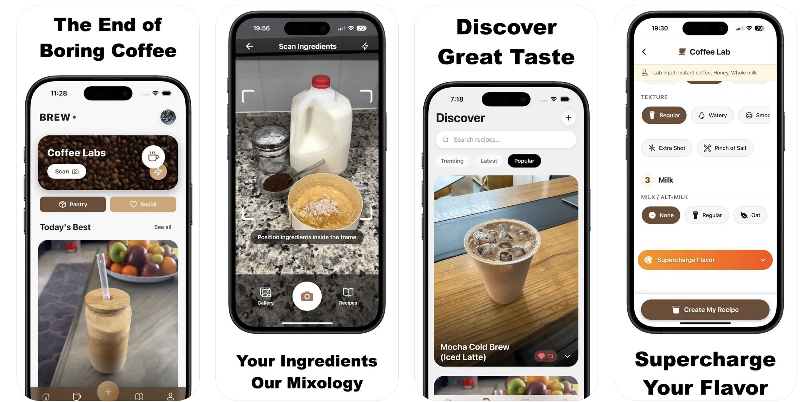

# BREW Coffee Labs ☕



**BREW Coffee Labs** Transform any pantry items into amazing coffee drinks. BREW Coffee Lab snaps a pic of what you have to create premium coffees. Make the best looking drink and post it!

Turn your kitchen into a creative café and unlock endless coffee possibilities—no extra shopping required. Simply scan your pantry, pick your vibe, and let our smart scanner craft a delicious coffee recipe tailored to what you already have on hand.

## 📑 Table of Contents

1. [✨ Features](#-features)
2. [🛠 Tech Stack](#-tech-stack)
3. [🚀 Getting Started](#-getting-started)
4. [⚙️ Configuration](#️-configuration)
5. [🔒 Security Setup](#-security-setup)
6. [🗄 Backend Setup](#-backend-setup)
   - [📊 Supabase Database Setup](#-supabase-database-setup)
   - [📁 Database Schema](#-database-schema)
   - [🔗 Cloudflare Workers (Image Upload)](#-cloudflare-workers-image-upload)
7. [📱 App Navigation & Pages](#-app-navigation--pages)
   - [🏠 Main Navigation (Tabs)](#-main-navigation-tabs)
   - [📄 Additional Pages](#-additional-pages)
8. [🏗 Project Structure](#-project-structure)
9. [📱 Building for Production](#-building-for-production)
10. [🧪 Testing](#-testing)
11. [🤝 Contributing](#-contributing)
12. [📄 License](#-license)
13. [🙏 Acknowledgments](#-acknowledgments)
14. [📞 Support](#-support)

FEATURES

- Instant Ingredient Recognition

Use your camera to capture the ingredients in your pantry. BREW's smart scanner reads what you've got—no more hunting for obscure items.

- Custom Coffee Creations

Select your vibe—sweet, iced, foamy, or classic—and receive step‑by‑step guidance for lattes, espressos, cold brews, and more.

- Interactive Community Feed

Share photos of your latest brew, browse trending recipes, "heart" favorites, and save must‑try ideas to your collection.

- Clean, Intuitive Design

Effortlessly navigate categories like Espresso, Latte, and Cold Brew. Our minimalist interface keeps you focused on brewing, not scrolling.

## ✨ Features

### Core Functionality
*   **AI Recipe Generation**: Generate personalized coffee recipes using Google Gemini AI based on your available ingredients and preferences
*   **Ingredient Scanner**: Use your camera to identify coffee ingredients and products
*   **Recipe Management**: Create, save, edit, and organize your coffee recipes
*   **Community Platform**: Share recipes, discover community creations, and engage with fellow coffee enthusiasts
*   **User Profiles**: Personalized profiles with recipe collections and preferences
*   **Social Features**: Like recipes, follow creators, and build your coffee community

### Technical Features
*   **Cross-platform**: Built with React Native and Expo for iOS and Android
*   **Real-time Database**: Powered by Supabase for seamless data synchronization
*   **Image Upload**: Cloudflare R2 integration for efficient image storage
*   **Authentication**: Multiple sign-in options (Email, Google, Apple)
*   **Offline Support**: Local storage for enhanced user experience
*   **AI Integration**: Google Gemini for recipe generation and content validation

## 🛠 Tech Stack

### Frontend
*   **React Native** (Expo SDK 51+)
*   **TypeScript** for type safety
*   **Expo Router** for navigation
*   **React Native Paper** for UI components

### Backend
*   **Supabase** (PostgreSQL database, Authentication, Edge Functions)
*   **Cloudflare Workers** for image upload handling
*   **Cloudflare R2** for image storage
*   **Google Gemini AI** for recipe generation and validation

### Development Tools
*   **Expo CLI** for development and building
*   **EAS CLI** for building and deployment
*   **ESLint** and **Prettier** for code quality

## 🚀 Getting Started

### Prerequisites
*   Node.js (v18 or later)
*   npm or yarn
*   Expo CLI: `npm install -g @expo/cli`
*   EAS CLI: `npm install -g eas-cli`
*   [Supabase CLI](https://supabase.com/docs/guides/cli) (for backend development)

### Installation

1.  **Clone the repository:**
    ```bash
    git clone <repository-url>
    cd BREW-Coffee-Labs
    ```

2.  **Install dependencies:**
    ```bash
    npm install
    ```

3.  **Set up environment variables:**
    ```bash
    cp .env.example .env
    ```
    Fill in your actual values in the `.env` file (see [Configuration](#configuration) section below).

4.  **Set up Supabase (if running backend locally):**
    ```bash
    supabase start
    supabase db reset
    ```

5.  **Start the development server:**
    ```bash
    npx expo start
    ```

6.  **Run on device/simulator:**
    *   iOS: Press `i` in the terminal or scan QR code with Camera app
    *   Android: Press `a` in the terminal or scan QR code with Expo Go app

## ⚙️ Configuration

### Environment Variables (.env)

Create a `.env` file in the root directory based on `.env.example`:

```env
# Supabase Configuration
EXPO_PUBLIC_SUPABASE_URL=https://your-project-id.supabase.co
EXPO_PUBLIC_SUPABASE_ANON_KEY=your_supabase_anonymous_key_here

# Google Gemini API Keys (for local development)
GEMINI_API_KEY=your_google_gemini_api_key_here
GEMINI_RECIPE_API_KEY=your_google_gemini_api_key_for_recipes
GEMINI_VALIDATION_API_KEY=your_google_gemini_api_key_for_validation

# Cloudflare Worker URL
EXPO_PUBLIC_API_URL=https://your-worker-name.your-subdomain.workers.dev

# Feature Toggles
USE_SUPABASE_EDGE_FUNCTIONS_FOR_GEMINI=true
```

**Important**: 
- Never commit your `.env` file to version control
- Replace all placeholder values with your actual API keys and URLs
- Get your Gemini API keys from [Google AI Studio](https://aistudio.google.com/)

## 🔒 Security Setup

### Required Environment Variables

The following environment variables must be configured for the app to work:

1. **EXPO_PUBLIC_SUPABASE_URL**: Your Supabase project URL
2. **EXPO_PUBLIC_SUPABASE_ANON_KEY**: Your Supabase anonymous/public key
3. **EXPO_PUBLIC_API_URL**: Your Cloudflare Worker URL for image uploads
4. **GOOGLE_IOS_URL_SCHEME**: Your Google OAuth client ID for iOS
5. **EAS_PROJECT_ID**: Your Expo Application Services project ID
6. **GEMINI_API_KEY**: Your Google Gemini API key (for local development)

### Supabase Edge Function Secrets

If using Supabase Edge Functions (recommended for production), set these secrets in your Supabase dashboard:

```bash
# Set in Supabase Dashboard > Settings > Edge Functions > Secrets
GEMINI_RECIPE_API_KEY=your_gemini_api_key_here
GEMINI_VALIDATION_API_KEY=your_gemini_api_key_here
```

### Cloudflare Worker Secrets

For the image upload worker, set these using `wrangler secrets`:

```bash
wrangler secret put SUPABASE_URL
wrangler secret put SUPABASE_KEY
```

### Security Best Practices

- Never commit API keys or secrets to version control
- Use environment variables for all sensitive configuration
- Regularly rotate API keys and access tokens
- Review and audit third-party dependencies
- Use HTTPS for all API communications

### App Configuration (app.config.js)

The `app.config.js` file contains application-level configurations and reads from environment variables. Key settings include:

*   **Supabase Integration**: Database URL and authentication keys
*   **API Endpoints**: Cloudflare Worker URLs for image uploads
*   **Feature Toggles**: Control whether to use Supabase Edge Functions or local API calls

## 🗄 Backend Setup

### 📊 Supabase Database Setup

The app uses Supabase for backend services. Follow these steps to set up your database:

1. **Create a Supabase project** at [supabase.com](https://supabase.com)
2. **Set up the database** using the provided schema file
3. **Configure authentication** providers (email, Google, Apple)
4. **Deploy Edge Functions** for Gemini AI integration (optional)

### 📁 Database Schema

**Important**: Use the provided `supabase_backup/schema.sql` file to replicate the exact database structure in your Supabase project.

#### To apply the schema:

1. **Via Supabase Dashboard SQL Editor:**
   ```sql
   -- Copy and paste the contents of supabase_backup/schema.sql
   -- into the SQL Editor in your Supabase dashboard
   ```

2. **Via Supabase CLI:**
   ```bash
   # Reset your local database to match the schema
   supabase db reset
   
   # Or apply the schema file directly
   supabase db push
   ```

#### Database Tables Overview:

The schema includes the following main tables:

- **`users`**: User profile information
  - `uuid` (Primary Key): User identifier linked to Supabase Auth
  - `name`: Display name
  - `email`: User email address
  - `profile_icon`: Profile picture URL
  - `num_likes_by_me`: Count of recipes liked by user
  - `num_liked_me`: Count of likes received on user's recipes
  - `total_num_bews`: Total number of recipes created
  - `is_pro`: Premium user status
  - `date_created`: Account creation timestamp

- **`recipes`**: Coffee recipe details
  - `uuid` (Primary Key): Recipe identifier
  - `creator_uuid`: Foreign key to users table
  - `title`: Recipe name
  - `ingredients`: JSON array of ingredients
  - `instructions`: JSON array of preparation steps
  - `image_url`: Recipe photo URL
  - `is_published`: Publication status
  - `like_count`: Number of likes received
  - `image_height`, `image_width`: Image dimensions
  - `created_at`, `updated_at`: Timestamps

- **`recipe_likes`**: User recipe interactions
  - `uuid` (Primary Key): Like identifier
  - `user_uuid`: Foreign key to users table
  - `recipe_uuid`: Foreign key to recipes table
  - `created_at`, `updated_at`: Timestamps

- **`user_pantry`**: User's saved ingredients
  - `user_uuid` (Primary Key): Foreign key to users table
  - `items`: JSON array of pantry items
  - `updated_at`: Last modification timestamp

- **`app_config`**: Application configuration settings
  - `version`: Current app version
  - `required_version`: Minimum required version
  - `maintenance_mode`: Maintenance status flag
  - `maintenance_message`: Message for maintenance mode
  - `id_prompt`: AI prompt for ingredient identification
  - `gen_prompt`: AI prompt for recipe generation

#### Database Functions:

The schema includes several PostgreSQL functions for automated operations:

- **`toggle_recipe_like(user_uuid, recipe_uuid)`**: Handles like/unlike actions
- **`update_like_count()`**: Automatically updates recipe like counts
- **`update_updated_at_column()`**: Updates timestamps on record changes
- **`increment_recipe_like_count()`**: Increments like count on new likes
- **`decrement_recipe_like_count()`**: Decrements like count on unlike

#### Row Level Security (RLS):

The schema includes comprehensive RLS policies for:
- User profile privacy and data access
- Recipe ownership and visibility
- Like system permissions
- Pantry data isolation
- App configuration read access

#### Database Indexes:

Optimized indexes are included for:
- Recipe search and filtering (`created_at`, `like_count`, `is_published`)
- User lookups (`creator_uuid`)
- Like system performance (`user_uuid`, `recipe_uuid`)

### 🔗 Cloudflare Workers (Image Upload)

The image upload functionality uses a Cloudflare Worker with R2 storage:

1. **Set up Cloudflare Worker** using files in `upload-worker-brew-main/`
2. **Configure R2 bucket** for image storage
3. **Set environment variables** in Cloudflare dashboard
4. **Update API_URL** in your `.env` file

Required Cloudflare environment variables:
*   `SUPABASE_URL`: Your Supabase project URL
*   `SUPABASE_KEY`: Your Supabase anonymous key

## 📱 App Navigation & Pages

### 🏠 Main Navigation (Tabs)

The app uses a tab-based navigation system with the following main screens:

#### **`index.tsx`** - Authentication & Landing
- **Purpose**: User authentication and app entry point
- **Features**:
  - Google Sign-In integration
  - Apple Sign-In (iOS only)
  - Animated word carousel showcasing coffee descriptors
  - Session management and auto-login
  - Terms and conditions acceptance
  - Automatic routing to home or profile creation

#### **`home.tsx`** - Discovery Feed
- **Purpose**: Main discovery hub for coffee recipes
- **Features**:
  - Trending recipes feed with real-time updates
  - Community picks and featured content
  - Recipe categories and filtering (Espresso, Latte, Cold Brew, etc.)
  - Interactive recipe cards with expandable details
  - Like/unlike functionality with haptic feedback
  - Pull-to-refresh and infinite scroll
  - Coffee Labs button for AI recipe generation
  - Maintenance mode and app update notifications

#### **`community.tsx`** - Social Discovery
- **Purpose**: Community-driven recipe discovery and sharing
- **Features**:
  - Advanced recipe filtering (trending, latest, popular, by type)
  - Search functionality with debounced queries
  - Deep linking support for recipe sharing
  - Recipe pagination with skeleton loading
  - Social engagement (likes, shares)
  - AppsFlyer analytics integration
  - Dynamic content loading based on filter selection

#### **`my-recipes.tsx`** - Personal Recipe Collection
- **Purpose**: User's personal recipe management
- **Features**:
  - Personal recipe library with expandable cards
  - Recipe statistics (likes, creation date)
  - Skeleton loading animations
  - Recipe editing and management
  - Local search and filtering
  - Profile integration with author information

#### **`profile.tsx`** - User Profile Management
- **Purpose**: User account and profile customization
- **Features**:
  - Profile picture upload with AI content validation
  - Name editing with inline validation
  - User statistics (total brews, likes given/received)
  - Cloudflare R2 image storage integration
  - Ghost loading states for smooth UX
  - Account logout functionality
  - Profile data persistence and caching

#### **`add-post.tsx`** - Recipe Creation
- **Purpose**: Create and share new coffee recipes
- **Features**:
  - Multi-step recipe creation wizard
  - Ingredient list management
  - Step-by-step instruction builder
  - Image upload and optimization
  - Recipe validation and content filtering
  - Draft saving and auto-recovery
  - Publishing controls and preview

### 📄 Additional Pages

Located in `/other-pages/`, these screens provide specialized functionality:

#### **`generate-recipe.tsx`** - AI Recipe Generation
- **Purpose**: AI-powered recipe creation from ingredients
- **Features**:
  - Google Gemini AI integration for recipe generation
  - Multi-modal input (text + images)
  - Customizable recipe parameters (strength, sweetness, temperature)
  - Real-time recipe generation with loading states
  - Content validation and safety checks
  - Recipe refinement and editing
  - Direct publishing to community feed
  - Error handling and retry mechanisms

#### **`lab.tsx`** - Coffee Customization Lab
- **Purpose**: Advanced coffee recipe customization
- **Features**:
  - Interactive ingredient and preference selection
  - Dynamic option compatibility checking
  - Real-time AI suggestions based on available ingredients
  - Coffee strength, temperature, and texture controls
  - Equipment and technique selection
  - Custom enhancement and infusion options
  - Recipe preview and modification
  - Smooth animations and haptic feedback

#### **`coffee-scanner.tsx`** - Camera Integration
- **Purpose**: Camera-based ingredient scanning
- **Features**:
  - Real-time camera preview with scan overlay
  - Adjustable scan area with pinch-to-zoom
  - Flash/torch toggle for better lighting
  - Gallery import alternative
  - Pantry loading for existing ingredients
  - Permission handling and settings deep-linking
  - Image capture and processing
  - Navigation to ingredient identification

#### **`id-ingridents.tsx`** - Ingredient Identification
- **Purpose**: AI-powered ingredient recognition and management
- **Features**:
  - Google Gemini Vision API for image analysis
  - Pantry mode for existing ingredient loading
  - Custom AI prompts from app configuration
  - Ingredient list display and editing
  - Error handling and retry mechanisms
  - Navigation to Coffee Labs for recipe creation
  - Supabase Edge Function integration

#### **`pantry.tsx`** - Pantry Management
- **Purpose**: Personal ingredient inventory management
- **Features**:
  - Add/remove pantry items with brand information
  - Ingredient categorization (ingredients vs. equipment)
  - Duplicate detection and management
  - Real-time saving to Supabase
  - Unsaved changes warning
  - Batch operations and data persistence
  - Type-safe item management

#### **`create-profile.tsx`** - Profile Setup
- **Purpose**: Initial user profile creation
- **Features**:
  - Welcome screen for new users
  - Profile information collection
  - Image upload and validation
  - Account setup completion
  - Navigation to main app after setup

#### **`rate-us.tsx`** - App Store Reviews
- **Purpose**: Encourage user reviews and feedback
- **Features**:
  - App Store/Play Store deep linking
  - Review prompts and incentives
  - User feedback collection
  - Rating system integration

## 🏗 Project Structure

```
BREW-Coffee-Labs/
├── app/                    # App screens (Expo Router)
│   ├── (tabs)/            # Tab-based navigation screens
│   │   ├── index.tsx      # Authentication & Landing
│   │   ├── home.tsx       # Discovery Feed
│   │   ├── community.tsx  # Social Discovery
│   │   ├── my-recipes.tsx # Personal Recipe Collection
│   │   ├── profile.tsx    # User Profile Management
│   │   └── add-post.tsx   # Recipe Creation
│   ├── other-pages/       # Additional screens
│   │   ├── generate-recipe.tsx  # AI Recipe Generation
│   │   ├── lab.tsx             # Coffee Customization Lab
│   │   ├── coffee-scanner.tsx  # Camera Integration
│   │   ├── id-ingridents.tsx   # Ingredient Identification
│   │   ├── pantry.tsx          # Pantry Management
│   │   ├── create-profile.tsx  # Profile Setup
│   │   └── rate-us.tsx         # App Store Reviews
│   └── _layout.tsx        # Root layout
├── components/            # Reusable UI components
├── constants/             # App constants and themes
├── hooks/                 # Custom React hooks
├── assets/               # Images, fonts, and static assets
├── supabase/             # Supabase configuration and functions
├── upload-worker-brew-main/ # Cloudflare Worker for image uploads
├── android/              # Android-specific files
├── ios/                  # iOS-specific files
├── config.ts             # App configuration
├── supabase.js           # Supabase client setup
├── authUtils.ts          # Authentication utilities
└── types.ts              # TypeScript type definitions
```

## 📱 Building for Production

### iOS

1. **Configure EAS Build:**
   ```bash
   eas build:configure
   ```

2. **Build for iOS:**
   ```bash
   eas build --platform ios
   ```

3. **Submit to App Store:**
   ```bash
   eas submit --platform ios
   ```

### Android

1. **Build for Android:**
   ```bash
   eas build --platform android
   ```

2. **Submit to Google Play:**
   ```bash
   eas submit --platform android
   ```

## 🧪 Testing

```bash
# Run tests
npm test

# Run tests with coverage
npm run test:coverage

# Lint code
npm run lint

# Type check
npm run type-check
```

## 🤝 Contributing

We welcome contributions! Please see our [Contributing Guidelines](CONTRIBUTING.md) for details.

1. Fork the repository
2. Create a feature branch
3. Make your changes
4. Add tests if applicable
5. Submit a pull request

## 📄 License

This project is licensed under the MIT License - see the [LICENSE](LICENSE) file for details.

## 🙏 Acknowledgments

*   **Expo Team** for the amazing React Native framework
*   **Supabase** for backend infrastructure
*   **Google AI** for Gemini API integration
*   **Cloudflare** for edge computing and storage solutions
*   **Coffee Community** for inspiration and feedback

## 📞 Support

For support and questions:
*   Create an issue in this repository
*   Check out our [Documentation](docs/)

---

**Happy brewing! ☕️**